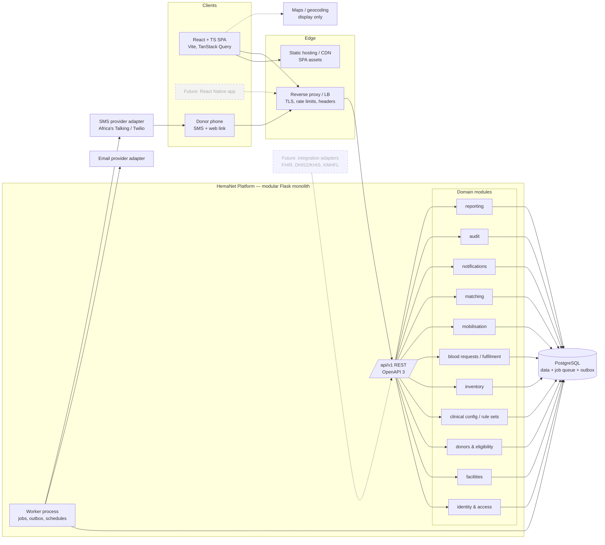

# 01 — Product: Vision, Users, Architecture, Scope

## 1. Product vision

**[CONFIRMED]** HemaNet connects donors, hospitals, blood banks and administrators. Its aims are to reduce delays in getting blood, improve visibility of availability, reduce expiry wastage and encourage regular donation (PDF §Project Description).

**[PROPOSED]** Long-term identity: a **blood-resource coordination network** for Kenya. It links donor mobilisation, collection, per-unit inventory, hospital requests and (later) inter-facility redistribution, with measurable outcomes.

## 2. Problem statement

**[VALIDATE]** The problems below come from the PDF's framing. They have not yet been confirmed with Kenyan hospitals or blood services (AS-01).

| # | Problem | Consequence | HemaNet response |
|---|---|---|---|
| P1 | Hospitals lack timely visibility of blood availability at supplying blood banks | Phone-call chains; delays in urgent cases | Derived real-time availability plus a structured request workflow |
| P2 | Requests and their status are tracked informally | No accountability or timing data | Request state machine with timestamps and audit |
| P3 | Donor recruitment is reactive and untargeted | Slow replenishment; donor fatigue | Explainable matching and staff-approved appeals |
| P4 | Stock expires unused | Wastage | Per-unit expiry tracking, expiring-soon views, FEFO allocation suggestions |
| P5 | No shared metrics | Improvement can't be measured | Impact metrics captured from day one (§NFR-M) |

## 3. Target users and personas

| Persona | Organisation | Primary questions | Label |
|---|---|---|---|
| **Wanjiru, regular donor** (29, Nairobi, smartphone) | none | Am I eligible? Am I needed? Where and when? What's my impact? | [CONFIRMED] |
| **Otieno, occasional donor** (41, rural, basic feature phone) | none | Receives SMS; may not have data access | [PROPOSED] persona — drives AS-22 (feature-phone access) |
| **Hospital requester** (ward/lab staff) | Hospital | What do we need, how urgent, who is supplying, when will it arrive? | [CONFIRMED] |
| **Hospital facility admin** | Hospital | Which of our staff have access? | [PROPOSED] |
| **Blood bank officer** | Blood bank / RBTC / hospital blood bank | What's in stock, what's expiring, what's requested? | [CONFIRMED] |
| **Blood bank manager** | Blood bank | Should we launch a donor appeal? Staff access? Stock thresholds? | [PROPOSED] split from officer |
| **Platform administrator** | HemaNet operator | Is the network working? Who needs verification? Anomalies? | [CONFIRMED] |
| **Clinical configuration approver** | Named, qualified person designated by a partner blood service | Are the active clinical rules the validated ones? | [PROPOSED] (ADR-005) |

**[VALIDATE] AS-02:** we assume Kenyan blood supply involves Regional Blood Transfusion Centres (RBTCs) and satellites supplying hospitals, some of which operate their own hospital blood banks. The facility model (§E, `facilities`) represents this through *capabilities* rather than fixed types, so that the real structure can be configured once confirmed.

## 4. User journeys (MVP)

**J1 — Donor onboarding** [CONFIRMED]
Register (name, phone/email, date of birth, self-reported blood group, county/sub-county, optional approximate location) → verify phone by OTP → accept consent notice → dashboard shows eligibility as *Potentially eligible / Requires review / Potentially ineligible*, with reasons and next possible date.

**J2 — Hospital urgent request (fulfilment)** [CONFIRMED]
Hospital requester opens "New request" → chooses component, ABO/Rh, units, urgency, required-by time → selects a supplying blood bank from the linked list (with live aggregate availability shown) → submits → watches the timeline: *Submitted → Accepted → Allocated → Issued → Received/Completed*.

**J3 — Blood bank handles a request** [CONFIRMED]
Officer sees the request in an urgency-sorted queue → accepts or declines (with reason) → opens allocation suggestions (compatible, available, soonest-expiring first, each with an explanation) → reserves units → issues → hospital confirms receipt.

**J4 — Shortage → donor appeal (mobilisation)** [CONFIRMED core, PROPOSED staff approval]
A low-stock threshold is breached, or a request can't be fully allocated → the system creates a *suggested* appeal → the manager reviews the target groups, collection site, time window and candidate preview (with explanations) → launches wave 1 → donors receive SMS/email/in-app alerts → donors accept or decline → accepted donors see where and when to go → staff check them in and **record the donation** → units are registered as QUARANTINED → released to AVAILABLE after local processing.

**J5 — Admin verification** [CONFIRMED]
A facility self-registers (with its KMHFL code) → appears in the admin verification queue → admin verifies out-of-band and records the method → the facility's founding admin activates → that admin invites staff.

**J6 — Reporting** [CONFIRMED]
Admin/manager views donation trends, shortages, donor activity, request performance and expiry wastage, and exports CSV.

## 5. Functional requirements (summary)

The full, labelled list is §B (MVP scope). Traceability to the PDF:

| PDF requirement | Blueprint location |
|---|---|
| Donor register with name, blood group, age, contact, location | J1; `donor_profiles` (age → **date of birth**, [PROPOSED]) |
| Donation history & eligibility (time since last donation, health status) | `donations`, `donor_deferrals`, eligibility engine (J §J.3); "health status" reduced to staff-recorded deferral **categories** [PROPOSED][VALIDATE] |
| Receive emergency alerts; accept/decline | Mobilisation (§H), notifications (§K) |
| Hospital register & location | `facilities` + verification |
| Submit requests (blood type, units, urgency) | `blood_requests` + component [PROPOSED] |
| View available inventory from blood banks and donors | Aggregate availability (§I); donor availability shown **only as banded counts** [PROPOSED — privacy] |
| Track request status (pending, matched, completed) | State machine §G (mapping given there) |
| Blood bank inventory (type, units, expiry) | Per-unit inventory §F/§I [CONFIRMED by decision 5] |
| Approve/reject hospital requests | `request_routings` accept/decline |
| Notify nearby donors when stock is low | Low-stock → suggested appeal → staff launch §H |
| Admin verify users | Facility verification + phone OTP for donors [PROPOSED modification: admin does not hand-verify individual donors] |
| Monitor activity, requests, inventory | Admin dashboard + audit log viewer |
| Reports: donation trends, shortages, donor activity | `reporting` module |
| SMS/email via Twilio/SendGrid | Provider-agnostic adapters; Africa's Talking evaluated for Kenya [PROPOSED] |
| Google Maps for location-based matching | Maps for display/geocoding only; distance computed in DB [PROPOSED, ADR-009] |
| S3 for prescriptions/certificates | **Excluded from MVP** — prescriptions are patient data (§C) |

## 6. Non-functional requirements

| ID | Requirement | Label |
|---|---|---|
| NFR-S1 | All authorization enforced server-side; frontend checks are only for UX | [CONFIRMED] (master instruction) |
| NFR-S2 | OWASP ASVS v4 Level 2 as the security verification reference | [PROPOSED] |
| NFR-P1 | Health-related personal data is "sensitive personal data" under Kenya's Data Protection Act 2019. Apply data minimisation, a DPIA before the pilot, and consent records | [VALIDATE] AS-41 (legal review) |
| NFR-P2 | Data residency may be constrained by the Data Protection (General) Regulations 2021 | [VALIDATE] AS-40 |
| NFR-R1 | Pilot availability target 99.5% monthly; HemaNet must never be the *only* path to obtain blood (documented manual fallback) | [PROPOSED] |
| NFR-R2 | RPO ≤ 5 min, RTO ≤ 4 h (pilot) | [PROPOSED] |
| NFR-PF1 | p95 API latency < 500 ms for dashboard/list endpoints at pilot scale (≤ 20 facilities, ≤ 50k donors, ≤ 100k units) | [PROPOSED] |
| NFR-PF2 | Usable on 3G-class connections: initial JS bundle < 250 KB gzipped, route-level code splitting | [PROPOSED] |
| NFR-A1 | WCAG 2.2 AA | [PROPOSED] |
| NFR-I1 | All UI strings externalised from day one; English at MVP, Kiswahili translation before donor-facing pilot | [PROPOSED][VALIDATE] AS-23 |
| NFR-T1 | All timestamps stored in UTC (`timestamptz`); displayed in `Africa/Nairobi` | [PROPOSED] |
| NFR-M | Capture timestamps needed for PDF success metrics: request→acceptance, request→issue, request→completion, appeal→first acceptance, acceptance→donation, units expired vs issued | [CONFIRMED] (PDF §Success Metrics) |
| NFR-O1 | Every API response carries `X-Request-ID`; structured JSON logs without PHI | [PROPOSED] |
| NFR-C1 | The same API serves web now and mobile later; no business logic lives only in React | [CONFIRMED] |

---

## A. Product architecture

**Key properties**

- **One deployable backend, two processes** [PROPOSED, ADR-001/003]: `api` (Gunicorn/Flask) and `worker` (the same codebase, a different entry point). Both are stateless apart from Postgres.
- **Domain modules** communicate through service interfaces and **domain events** written to an `outbox_events` table in the same transaction as the state change. The worker consumes them to send notifications, run matching and update projections. This gives us event-driven behaviour without a message broker.
- **Clinical logic isolation:** only `eligibility`, `matching` and `inventory.allocation` read clinical rule sets, and only through `clinical_config.get_active_rule_set(domain)`. No clinical values appear anywhere else.
- **Integration boundary:** external representations (future FHIR, SMS inbound, provider webhooks) terminate in `integrations/` or `notifications/providers/` adapters. They never reach domain models directly (§X).

---

## B. Exact MVP scope

"MVP" means Phase 1: a production-quality web MVP, fit to enter a controlled pilot **after** the validation work in §AA.

### B.1 Identity & access
| Feature | Label |
|---|---|
| Email-or-phone + password login; Argon2id hashing | [CONFIRMED] (login) / [PROPOSED] (details) |
| Phone OTP verification (donors required; staff required) | [PROPOSED] |
| Email verification for staff accounts | [PROPOSED] |
| Password reset by email or SMS OTP | [PROPOSED] |
| Short-lived access token + rotating, revocable refresh token | [PROPOSED] ADR-007 |
| TOTP MFA **mandatory for platform admins and clinical-config approvers**; optional for others | [PROPOSED] |
| Roles → permissions, facility-scoped memberships | [CONFIRMED] RBAC / [PROPOSED] model ADR-008 |
| Staff invited by their facility admin; memberships revocable | [PROPOSED] |
| Session list and "sign out other sessions" | [PROPOSED] |

### B.2 Facilities
| Feature | Label |
|---|---|
| Facility self-registration (name, KMHFL code, type, county/sub-county, address, coordinates, contacts) | [CONFIRMED] (hospital registration) / [PROPOSED] (blood bank self-registration, KMHFL code) |
| Facility capabilities: `can_request_blood`, `can_hold_inventory`, `can_collect_donations` | [PROPOSED] (supports AS-02) |
| Admin verification queue; verify/reject/suspend with recorded method and notes | [CONFIRMED] |
| Supply links (which blood banks serve which hospitals), managed by admin | [PROPOSED][VALIDATE] AS-03 |
| Storage locations (name, type) per facility | [PROPOSED]: cheap now, enables cold chain later |

### B.3 Donors
| Feature | Label |
|---|---|
| Registration: full name, phone, optional email, date of birth, self-reported ABO/Rh, county, sub-county, optional approximate location | [CONFIRMED] (age → DOB [PROPOSED]) |
| Blood group source: `SELF_REPORTED` vs `LAB_CONFIRMED` (confirmed by blood bank staff) | [PROPOSED] |
| Consent capture (versioned notice, timestamp) | [PROPOSED][VALIDATE] AS-41 |
| Availability toggle (available / unavailable until date / opted out) | [PROPOSED] |
| Notification preferences: channels, quiet hours, max alerts per 30 days | [PROPOSED] |
| Donation history (staff-recorded only) | [CONFIRMED] |
| Eligibility status calculated by the server from validated rule set: 3-state output + reasons + next possible date | [CONFIRMED] (eligibility) / [PROPOSED] (3-state, rule-set driven) / [VALIDATE] all rule values |
| Staff-recorded deferrals (category code + dates only; no clinical detail) | [PROPOSED][VALIDATE] AS-13 |
| Donor account deactivation and data export request | [PROPOSED][VALIDATE] AS-42 |

### B.4 Clinical configuration (rule sets)
| Feature | Label |
|---|---|
| Versioned rule sets for: `COMPATIBILITY`, `DONOR_ELIGIBILITY`, `COMPONENT_SPEC`, `URGENCY` | [PROPOSED] ADR-005 |
| Lifecycle DRAFT → PENDING_VALIDATION → VALIDATED → ACTIVE → RETIRED; one ACTIVE per domain | [PROPOSED] |
| Validation record: validator name, role, organisation, source document reference, date | [PROPOSED] |
| Environment guard `REQUIRE_VALIDATED_RULES=true` in pilot/production | [PROPOSED] |
| Dev seed rule sets labelled **DEVELOPMENT MOCK — NOT CLINICALLY VALIDATED**, with a UI banner | [PROPOSED] |
| Component catalogue: RBC, FFP/plasma, platelets, cryoprecipitate, whole blood (codes only; specs via rule set) | [CONFIRMED] decision 6 |

### B.5 Inventory (per-unit)
| Feature | Label |
|---|---|
| Register unit: identifier, component, ABO/Rh, collection date, expiry, source, storage location, optional link to donation / parent unit | [CONFIRMED] decision 5 |
| Bulk registration: keyboard-wedge barcode scanner input + CSV import (validated, atomic) | [PROPOSED][VALIDATE] AS-30 |
| Unit status machine (§F) incl. QUARANTINED, AVAILABLE, RESERVED, ISSUED, RECEIVED, EXPIRED, DISCARDED | [PROPOSED] |
| Release from quarantine by authorised staff (records that local testing/processing is complete; **no test results stored**) | [PROPOSED][VALIDATE] AS-14 |
| Append-only unit event history (chain of custody within HemaNet) | [CONFIRMED] decision 5 (traceability) |
| Derived availability (counts by facility × component × ABO × Rh, earliest expiry, last updated) | [CONFIRMED] decision 5 |
| Expiring-soon view (window configurable per component) | [CONFIRMED] (track expiry) |
| Automatic expiry job **and** query-time expiry filter | [PROPOSED] |
| Low-stock thresholds per facility × component × group (values set by the facility, not by HemaNet) | [CONFIRMED] (notify when low) / [PROPOSED] (mechanism) |
| Discard with controlled reason codes | [PROPOSED][VALIDATE] AS-16 |

### B.6 Blood requests (fulfilment)
| Feature | Label |
|---|---|
| Create request: component, ABO/Rh, units, urgency level, required-by, optional external reference, optional notes (with PHI warning) | [CONFIRMED] (+component [PROPOSED]) |
| **No patient identifiers** stored | [PROPOSED] ADR-013 |
| Route to one linked blood bank; re-route after decline | [PROPOSED][VALIDATE] AS-03 |
| Blood bank accept/decline with reason code | [CONFIRMED] |
| Allocation suggestions from the inventory matcher (compatible per active rule set, FEFO, explained) | [PROPOSED] |
| Reserve units (concurrency-safe), release reservation, reservation timeout | [PROPOSED] |
| Issue units; hospital confirms receipt | [PROPOSED][VALIDATE] AS-05 |
| Cancel (hospital), close partially fulfilled (hospital), auto-expire past required-by + grace | [PROPOSED] |
| Status timeline and PDF status mapping | [CONFIRMED] |
| "Create donor appeal from shortfall" action | [CONFIRMED] decision 4 |

### B.7 Mobilisation
| Feature | Label |
|---|---|
| Appeals (campaigns): trigger type, target component and groups, collection site, time window, donors needed, urgency | [CONFIRMED] decision 4 |
| Suggested appeals generated from low stock / shortfall; **staff launch required** | [PROPOSED] |
| Candidate preview with per-donor explanation; donors masked until they accept | [PROPOSED] |
| Waves (batch sizes); "send next wave" | [PROPOSED] |
| Donor response via in-app or signed SMS/email link (accept/decline, optional reason) | [CONFIRMED] |
| Simple appointment: accepted donor picks an arrival slot within the window | [PROPOSED] |
| Staff check-in, no-show, and **donation recording** | [CONFIRMED] decision 4 |
| Contact cooldown and per-donor alert caps | [PROPOSED] |

### B.8 Notifications
| Feature | Label |
|---|---|
| Notification subsystem: notification + per-channel deliveries, templates, priority, retries, idempotency | [CONFIRMED] (master instruction §17) |
| Channels: in-app, email, SMS | [CONFIRMED] |
| Provider adapters; console/mailpit providers in dev labelled DEVELOPMENT MOCK | [PROPOSED] |
| Delivery-status webhooks (SMS DLR, email events) | [PROPOSED] |
| Escalation: unacknowledged request after the urgency level's `escalation_after_minutes` → notify managers + platform admin | [PROPOSED][VALIDATE] AS-10 |

### B.9 Dashboards & reports
| Feature | Label |
|---|---|
| Role dashboards (donor, hospital, blood bank, admin), polling-based refresh | [CONFIRMED] / [PROPOSED] polling ADR-012 |
| Reports: donation trends, shortages, donor activity, request performance, expiry wastage; CSV export | [CONFIRMED] (first three) / [PROPOSED] (last two) |
| Admin notification-delivery health view | [PROPOSED] |

### B.10 Cross-cutting
| Feature | Label |
|---|---|
| Append-only, hash-chained audit log; admin viewer | [CONFIRMED] audit / [PROPOSED] hash chain ADR-011 |
| Structured logging, request IDs, health endpoints, error tracking with PII scrubbing | [PROPOSED] |
| OpenAPI spec generated from code; TS types generated from it | [PROPOSED] ADR-014 |
| i18n scaffolding | [PROPOSED] |
| Docker-based local environment; CI with tests, lint, type-check, security scans | [PROPOSED] |

### B.11 Explicitly *not* in MVP
See §C. Also out of scope: patient records, cross-matching workflow, transfusion records at the bedside, payments/billing (e.g., SHA claims), and any hospital-side inventory beyond what the per-unit model already supports.

---

## C. Deferred features

| Feature | Phase | Label | Extension point built in MVP (only if cheap and migration-avoiding) |
|---|---|---|---|
| PostGIS spatial queries | V1 | [FUTURE] | `latitude`/`longitude` numeric columns + a `geo` module interface `find_within_radius()`; swap implementation later (ADR-009) |
| WebSockets / SSE real-time | V1 | [FUTURE] | Domain events in outbox; frontend query keys designed for invalidation |
| Inter-facility transfers | V1 | [FUTURE] | Unit statuses `IN_TRANSIT`, event types `TRANSFER_DISPATCHED/RECEIVED` reserved in enums; `unit_events.facility_id` |
| QR/barcode label printing | V1 | [FUTURE] | `unit_identifier` accepts scanner input now; format validation pluggable (ISBT 128 AS-31) |
| Facility document upload (licences) to object storage | V1 | [FUTURE] | Verification record has `method` + `evidence_reference` text |
| Real-time aggregate "network map" | V1 | [FUTURE] | Availability view already per facility |
| KMHFL registry lookup for facility verification | V1 | [FUTURE] | `kmhfl_code` column |
| Donor self-screening questionnaire | V2 | [FUTURE] | Eligibility engine already has a 3-state output + rule types |
| Push notifications, mobile app | V2 | [FUTURE] | Channel enum includes `PUSH`; token auth usable by non-browser clients |
| Two-way SMS / USSD donor responses | V1–V2 | [FUTURE][VALIDATE] AS-22 | Response service is channel-agnostic (`respond(candidate, response, channel)`) |
| Donor impact stories ("your donation contributed…") | V2 | [FUTURE][VALIDATE] AS-43 | `unit_events` link donation → unit → issue |
| Cold-chain monitoring (manual/IoT readings) | V2 | [FUTURE] | `storage_locations` table |
| Hospital-side final disposition (transfused/returned/wasted) | V2 | [FUTURE][VALIDATE] | Unit status machine extensible |
| Recall workflow | V2 | [FUTURE] | Unit lineage via `donation_id`, `parent_unit_id` |
| FHIR/HL7, DHIS2/KHIS reporting | V3 | [FUTURE] | Clean domain models; `integrations/` package placeholder only |
| Demand prediction / ML | V3 | [FUTURE] | Event history and reporting schema; baseline heuristics first |
| Regional coordination / multi-county operations | V3 | [FUTURE] | County on all facilities/donors |
| S3 prescriptions upload (PDF) | — | **Not recommended** | Patient data; not needed for coordination |
| Blockchain traceability (PDF) | — | **Rejected** (ADR-011) | Hash-chained audit log gives tamper-evidence |
