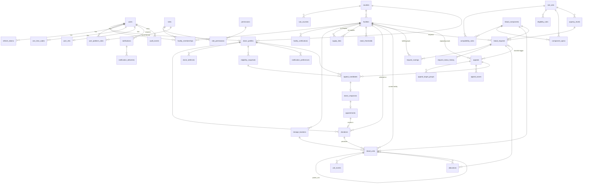
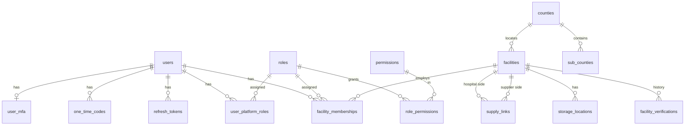
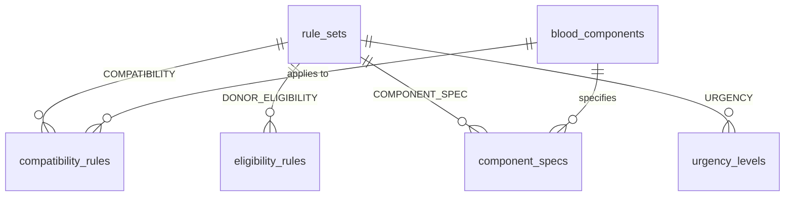
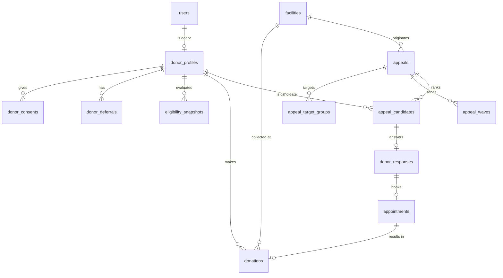
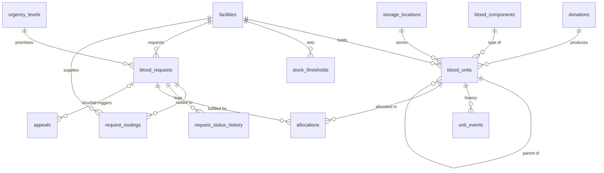
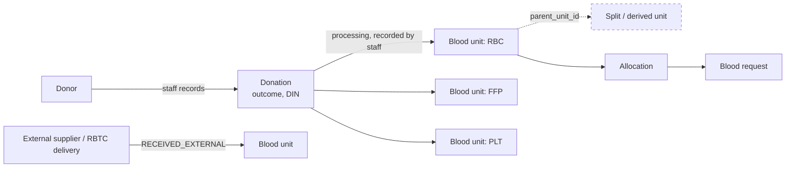
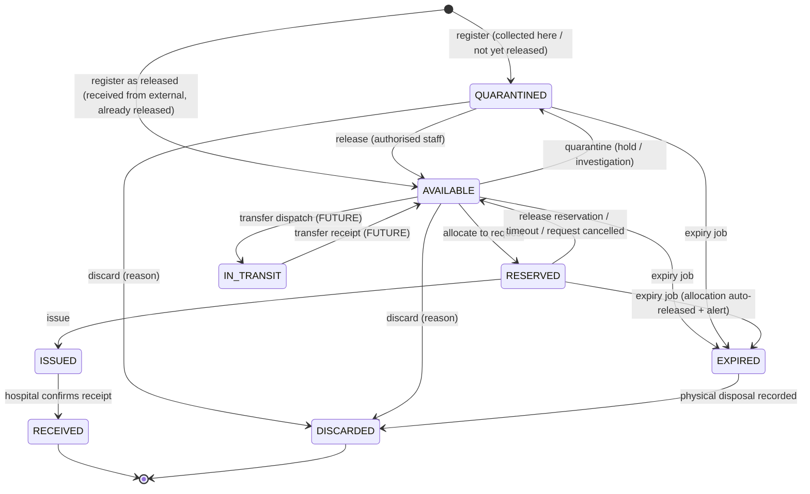

# 02 — Data Model

Conventions [PROPOSED]:
- PostgreSQL 16. SQLAlchemy 2.0 models, Alembic migrations (via Flask-Migrate).
- Primary keys: `uuid` (v7 where available, else v4) — non-enumerable (reduces IDOR guessing), merge-friendly for future multi-region. Append-only high-volume tables (`audit_events`, `unit_events`, `outbox_events`, `jobs`) use `bigint identity` for ordering. Human-facing references use separate `reference_code` columns (e.g., `REQ-2026-000123`) (ADR-016).
- Every mutable table: `created_at timestamptz not null default now()`, `updated_at timestamptz not null`, and `version integer not null default 1` where concurrent edits are possible (optimistic locking).
- Soft deletion (`deleted_at`) **only** for: `users`, `facilities`, `donor_profiles`. Clinical/operational records (units, donations, requests, allocations) are never deleted — they move to terminal statuses.
- Controlled values are PostgreSQL enums **for stable state machines** (statuses) and **reference tables** for values that may change by configuration (components, urgency levels, reason codes). Rationale: enum changes need migrations (appropriate for code-coupled states); reference tables can be edited under rule-set control.
- `citext` for emails. Phone numbers stored in E.164 (`+2547XXXXXXXX`), validated server-side.
- `jsonb` is used only where structure is legitimately variable: rule parameters, match explanations, notification template variables, audit diffs. Never for core business state.

---

## D. Complete ERD



The full diagram above is dense, so the same relationships are repeated below, split by domain for readability.

### D.1 Identity, access & facilities


### D.2 Clinical configuration (rule sets)


### D.3 Donors, donations & mobilisation


### D.4 Inventory, requests & fulfilment


Tables outside the diagram (infrastructure): `outbox_events`, `jobs`, `idempotency_keys`, `login_attempts`, `reason_codes`, `consent_notices`, `donor_consents`.

---

## E. Database entities and relationships

Notation: **PK**, **FK→table**, **UQ** unique, **IX** index, **CK** check. Types abbreviated.

### E.1 Identity & access

**`users`** [CONFIRMED core / PROPOSED fields]
| Column | Type | Notes |
|---|---|---|
| id | uuid PK | |
| full_name | text not null | |
| email | citext null UQ (partial, where deleted_at is null) | |
| phone_e164 | text null UQ (partial) | CK regex `^\+[1-9]\d{7,14}$` |
| password_hash | text not null | Argon2id |
| status | enum `user_status` (PENDING_VERIFICATION, ACTIVE, SUSPENDED, DEACTIVATED) | |
| email_verified_at, phone_verified_at | timestamptz null | |
| preferred_language | text not null default 'en' | CK in ('en','sw') |
| last_login_at | timestamptz null | |
| token_version | int not null default 1 | bumped on password change / suspension → invalidates outstanding access tokens |
| created_at, updated_at, deleted_at | | |
CK: `email is not null or phone_e164 is not null`.
Note: PDF `role` column on Users is replaced by `user_platform_roles` + `facility_memberships` (a user may be a donor *and* hospital staff).

**`roles`**: id, code UQ (DONOR, HOSPITAL_REQUESTER, HOSPITAL_ADMIN, BLOOD_BANK_OFFICER, BLOOD_BANK_MANAGER, PLATFORM_ADMIN, CLINICAL_CONFIG_APPROVER), scope enum (PLATFORM, FACILITY), name, description. Seeded by migration.
**`permissions`**: id, code UQ (e.g. `blood_request.create`), description.
**`role_permissions`**: role_id FK, permission_id FK, PK(role_id, permission_id).
**`user_platform_roles`**: user_id FK, role_id FK (scope PLATFORM), granted_by FK→users, granted_at, revoked_at; UQ active (user_id, role_id) where revoked_at is null.

**`facility_memberships`**
| Column | Notes |
|---|---|
| id uuid PK | |
| user_id FK→users, facility_id FK→facilities, role_id FK→roles (scope FACILITY) | |
| status enum (INVITED, ACTIVE, SUSPENDED, REVOKED) | |
| invited_by FK→users, invited_at, activated_at, revoked_at, revoked_by | |
UQ (user_id, facility_id, role_id) where status in (INVITED, ACTIVE). IX (facility_id, status).

**`refresh_tokens`**: id, user_id FK, token_hash UQ (SHA-256 of opaque token), family_id uuid (rotation family), issued_at, expires_at, last_used_at, revoked_at, revoked_reason, replaced_by_id, user_agent (truncated), client_type enum (WEB, MOBILE). IX (user_id, revoked_at). Reuse of a rotated token revokes the whole family.
**`one_time_codes`**: id, user_id FK null, destination_hash, purpose enum (PHONE_VERIFY, EMAIL_VERIFY, PASSWORD_RESET, INVITE_ACCEPT, MFA_RECOVERY), code_hash, expires_at, consumed_at, attempt_count, CK attempt_count ≤ 5.
**`user_mfa`**: user_id PK/FK, totp_secret_encrypted bytea (app-level encryption, key from secrets manager), enabled_at, recovery_codes_hashed text[].
**`login_attempts`**: id bigint, identifier_hash, success bool, occurred_at, ip_prefix_hash. Used for progressive backoff/lockout. Retention 30 days.

### E.2 Geography [PROPOSED]
**`counties`**: id smallint PK, code UQ (official county code 001–047), name. Seeded from an authoritative source [VALIDATE AS-44: source list].
**`sub_counties`**: id PK, county_id FK, name, UQ(county_id, name).

### E.3 Facilities
**`facilities`**
| Column | Notes |
|---|---|
| id uuid PK, reference_code UQ (`FAC-000123`) | |
| name text not null | |
| facility_type enum (HOSPITAL, BLOOD_SERVICE_CENTRE, HOSPITAL_BLOOD_BANK, OTHER) | descriptive only |
| can_request_blood, can_hold_inventory, can_collect_donations bool not null | capabilities drive permissions — [PROPOSED][VALIDATE AS-02] |
| kmhfl_code text null UQ | Kenya Master Health Facility List code [PROPOSED] |
| county_id FK, sub_county_id FK null, address_text | |
| latitude numeric(9,6) null, longitude numeric(9,6) null | CK ranges; CK both-null-or-both-set |
| phone_e164, email | |
| verification_status enum (PENDING, VERIFIED, REJECTED, SUSPENDED) | |
| created_at, updated_at, deleted_at, version | |
IX (verification_status), IX (county_id), IX (latitude, longitude).

**`facility_verifications`** (history): id, facility_id FK, decision enum (VERIFIED, REJECTED, SUSPENDED, REINSTATED), method enum (KMHFL_LOOKUP, PHONE_CALLBACK, SITE_VISIT, DOCUMENT_REVIEW, OTHER), evidence_reference text, notes text, decided_by FK→users, decided_at.

**`supply_links`** [PROPOSED][VALIDATE AS-03]: id, hospital_facility_id FK, supplier_facility_id FK, priority smallint, active bool, created_by, created_at. UQ(hospital, supplier). CK hospital ≠ supplier.

**`storage_locations`** [PROPOSED]: id, facility_id FK, name, storage_type enum (REFRIGERATOR, FREEZER, PLATELET_STORAGE, OTHER), active, UQ(facility_id, name). Temperature requirements are **not** stored here; they belong to `component_specs` (rule-set controlled).

**`stock_thresholds`** [PROPOSED]: id, facility_id FK, component_id FK, abo, rh, minimum_units int CK ≥ 0, updated_by, updated_at. UQ(facility_id, component_id, abo, rh). Values are set by the facility.

### E.4 Clinical configuration (ADR-005)
**`rule_sets`**
| Column | Notes |
|---|---|
| id uuid PK | |
| domain enum (COMPATIBILITY, DONOR_ELIGIBILITY, COMPONENT_SPEC, URGENCY) | |
| version_label text | e.g. `2026.1` |
| status enum (DRAFT, PENDING_VALIDATION, VALIDATED, ACTIVE, RETIRED) | |
| is_development_mock bool not null | true for seeded placeholders; **cannot** be activated when `REQUIRE_VALIDATED_RULES=true` |
| validated_by_name, validated_by_role, validated_by_organisation, validation_source_reference, validated_at | required to enter VALIDATED |
| recorded_by FK→users (who entered the validation record), activated_by FK→users, activated_at, retired_at | |
| notes | |
UQ (domain) where status = 'ACTIVE' (partial unique index → exactly one active per domain). Entries of a rule set are immutable once status ≥ PENDING_VALIDATION (enforced by service + DB trigger). Changes = new version.

**`blood_components`** [CONFIRMED decision 6]: id smallint, code UQ (WB, RBC, FFP, PLT, CRYO), display_name, active. Codes are domain vocabulary; *properties* are in `component_specs`.

**`component_specs`**: id, rule_set_id FK, component_id FK, shelf_life_value int, shelf_life_unit enum (HOURS, DAYS), storage_temp_min_c numeric(4,1), storage_temp_max_c numeric(4,1), expiring_soon_window_hours int, notes. UQ(rule_set_id, component_id). Used to *suggest/validate* expiry on unit registration; the entered label expiry remains authoritative [PROPOSED][VALIDATE AS-15].

**`compatibility_rules`**: id, rule_set_id FK, component_id FK, recipient_abo enum, recipient_rh enum, product_abo enum, product_rh enum, compatibility enum (COMPATIBLE, CONDITIONAL, INCOMPATIBLE), preference_rank smallint (1 = preferred), condition_note text. UQ(rule_set_id, component_id, recipient_abo, recipient_rh, product_abo, product_rh). Evaluation is **deny-by-default**: a missing row = incompatible.

**`eligibility_rules`**: id, rule_set_id FK, rule_code text, rule_type enum (MIN_AGE_YEARS, MAX_AGE_YEARS, MIN_DAYS_SINCE_LAST_DONATION, ACTIVE_DEFERRAL, BLOOD_GROUP_CONFIRMATION_REQUIRED, …), parameters jsonb (validated against a per-type JSON schema in code), outcome_if_failed enum (POTENTIALLY_INELIGIBLE, REQUIRES_REVIEW), applies_to jsonb null (e.g., donation type), display_message_key. UQ(rule_set_id, rule_code).

**`urgency_levels`**: id, rule_set_id FK, code, display_name, rank smallint (1 = most urgent), target_acknowledge_minutes int, escalation_after_minutes int, reservation_hold_minutes int, bypass_quiet_hours bool not null default false, colour_token text. UQ(rule_set_id, code). Requests store the `urgency_level_id` they were created with (historic accuracy across versions).

**`reason_codes`** [PROPOSED]: id, category enum (REQUEST_DECLINE, REQUEST_CANCEL, UNIT_DISCARD, DEFERRAL_CATEGORY, DONOR_DECLINE, DONATION_OUTCOME, STATUS_CORRECTION), code, display_name, active. UQ(category, code). Reason codes replace free text for business-critical states.

### E.5 Donors
**`donor_profiles`**
| Column | Notes |
|---|---|
| id uuid PK, user_id FK UQ | |
| donor_reference text UQ | short human code (e.g., `DNR-7K3P9Q`) shown on the donor's profile for staff lookup; future QR donor ID (PDF future enhancement) encodes this |
| date_of_birth date not null | replaces PDF `age` |
| sex_at_birth enum null (FEMALE, MALE, INTERSEX, UNDISCLOSED) | **collected only if a validated eligibility rule requires it** [VALIDATE AS-12] |
| abo enum (A, B, AB, O, UNKNOWN), rh enum (POS, NEG, UNKNOWN) | |
| blood_group_source enum (SELF_REPORTED, LAB_CONFIRMED) | |
| blood_group_confirmed_at, blood_group_confirmed_by_facility_id FK null | |
| county_id FK, sub_county_id FK null | |
| approx_latitude numeric(5,2), approx_longitude numeric(6,2) null | **rounded server-side to 2 dp (~1.1 km) before storage**; precise home location is never stored [PROPOSED] privacy |
| availability enum (AVAILABLE, UNAVAILABLE, OPTED_OUT), unavailable_until date null | |
| last_contacted_at timestamptz null | for cooldown/fairness |
| created_at, updated_at, deleted_at, version | |
IX (abo, rh, availability) where deleted_at is null; IX (county_id); IX (approx_latitude, approx_longitude).
Note: PDF `last_donation_date` and `eligibility_status` are **derived** (from `donations` and the eligibility engine), not stored — avoids stale/contradictory state.

**`consent_notices`**: id, version UQ, language, content_hash, published_at.
**`donor_consents`**: id, donor_id FK, consent_notice_id FK, purpose enum (ACCOUNT, APPEAL_NOTIFICATIONS), granted_at, withdrawn_at.

**`notification_preferences`**: id, user_id FK, channel enum, enabled bool, UQ(user_id, channel); plus on donor_profiles-adjacent table `donor_contact_limits`: donor_id PK, quiet_hours_start time null, quiet_hours_end time null, max_appeals_per_30_days smallint null (null → platform default).

**`donations`** [CONFIRMED; staff-recorded only]
| Column | Notes |
|---|---|
| id uuid PK, reference_code UQ | |
| donor_id FK→donor_profiles | |
| collection_facility_id FK→facilities (must have can_collect_donations) | |
| donation_identification_number text null UQ (per issuing system) | the label ID from the blood bank's own system [VALIDATE AS-31] |
| donation_type code (FK reason-like reference) | e.g. WHOLE_BLOOD; values [VALIDATE] |
| outcome enum (COLLECTED, DEFERRED_AT_SCREENING, INCOMPLETE) | |
| collected_at timestamptz | |
| appointment_id FK null UQ | links mobilisation → donation |
| recorded_by FK→users, recorded_at | |
| created_at, updated_at, version | |
IX (donor_id, collected_at desc).

**`donor_deferrals`** [PROPOSED][VALIDATE AS-13]: id, donor_id FK, deferral_category_code FK→reason_codes (category DEFERRAL_CATEGORY), deferral_type enum (TEMPORARY, INDEFINITE), starts_on, ends_on null (CK temporary ⇒ ends_on not null), recorded_by FK, facility_id FK, lifted_at, lifted_by. **No free-text medical detail.**

**`eligibility_snapshots`**: id, donor_id FK, evaluated_at, rule_set_id FK, result enum (POTENTIALLY_ELIGIBLE, POTENTIALLY_INELIGIBLE, REQUIRES_REVIEW), reasons jsonb (list of `{rule_code, outcome, message_key}`), next_possible_date date null, context enum (DONOR_VIEW, MATCHING, STAFF_VIEW). Written when used for a decision (matching) so decisions are reproducible; not the source of truth.

### E.6 Inventory
**`blood_units`** — see §F for lifecycle
| Column | Notes |
|---|---|
| id uuid PK | |
| unit_identifier text not null | label/barcode value; UQ (issuing_system, unit_identifier) |
| issuing_system text not null default 'LOCAL' | namespace for identifiers from different blood services [VALIDATE AS-31] |
| component_id FK | |
| abo enum (A,B,AB,O), rh enum (POS,NEG) | **no UNKNOWN** allowed for units |
| volume_ml int null | |
| collected_at timestamptz null, expires_at timestamptz not null | CK expires_at > collected_at |
| source enum (DONATION_RECORDED_HERE, RECEIVED_EXTERNAL) | |
| donation_id FK null, parent_unit_id FK→blood_units null | lineage |
| batch_reference text null | for per-batch receipts (consignment/delivery note) |
| status enum `unit_status` | §F |
| current_facility_id FK, storage_location_id FK null | |
| registered_by FK, created_at, updated_at, version | |
Indexes:
- IX `available_lookup` (current_facility_id, component_id, abo, rh, expires_at) WHERE status = 'AVAILABLE'
- IX (expires_at) WHERE status in ('AVAILABLE','QUARANTINED','RESERVED')
- IX (donation_id), IX (parent_unit_id)

**`unit_events`** (append-only, chain of custody): id bigint identity PK, unit_id FK, event_type enum, from_status, to_status, facility_id FK, actor_user_id FK null (null ⇒ system), occurred_at, recorded_at default now(), reason_code_id FK null, related_request_id FK null, related_allocation_id FK null, note text null (short, no PHI), metadata jsonb null. IX (unit_id, id). UPDATE/DELETE revoked at DB level (see §Q).

**View `inventory_availability`**: `SELECT current_facility_id, component_id, abo, rh, count(*) units, min(expires_at) earliest_expiry, max(updated_at) last_change FROM blood_units WHERE status='AVAILABLE' AND expires_at > now() GROUP BY 1,2,3,4`. Materialise later only if needed.

### E.7 Requests & fulfilment
**`blood_requests`**
| Column | Notes |
|---|---|
| id uuid PK, reference_code UQ (`REQ-2026-000123`) | |
| requesting_facility_id FK (must have can_request_blood) | |
| created_by FK→users | |
| component_id FK, abo enum, rh enum | patient/recipient group as ordered — **no patient identity** |
| units_requested int CK > 0 AND ≤ configured max | |
| urgency_level_id FK | |
| required_by timestamptz | |
| status enum `request_status` | §G |
| external_reference varchar(50) null | hospital's own slip number; UI warns "no patient names" |
| notes varchar(500) null | PHI warning; visible only to requesting + routed facility |
| cancel_reason_code_id FK null, closed_reason_code_id FK null | |
| submitted_at, accepted_at, first_allocated_at, issued_at, completed_at, cancelled_at | metric timestamps (NFR-M) |
| created_at, updated_at, version | |
IX (requesting_facility_id, status), IX (status, urgency_level_id, required_by).
Derived (not stored): units_reserved, units_issued, units_received — from `allocations`.

**`request_routings`**: id, request_id FK, supplier_facility_id FK, status enum (PENDING, ACCEPTED, DECLINED, WITHDRAWN), routed_by, routed_at, responded_by, responded_at, decline_reason_code_id. UQ (request_id) where status in ('PENDING','ACCEPTED') — only one active supplier at a time in MVP [PROPOSED]; multiple suppliers is [FUTURE].

**`request_status_history`**: id bigint, request_id FK, from_status, to_status, actor_user_id null, reason_code_id null, occurred_at. Append-only.

**`allocations`**
| Column | Notes |
|---|---|
| id uuid PK | |
| request_id FK, routing_id FK, unit_id FK | |
| status enum (RESERVED, RELEASED, ISSUED, RECEIVED, RETURNED) | RETURNED is [FUTURE] |
| reserved_by, reserved_at, reservation_expires_at | |
| released_at, released_reason_code_id | |
| issued_by, issued_at | |
| received_by, received_at | hospital confirmation |
Critical constraint: **UQ (unit_id) WHERE status IN ('RESERVED','ISSUED','RECEIVED')** — a unit can never be held by two allocations. Combined with `SELECT … FOR UPDATE` on units during allocation.

### E.8 Mobilisation
**`appeals`**
| Column | Notes |
|---|---|
| id uuid PK, reference_code UQ (`APL-2026-000045`) | |
| originating_facility_id FK (blood bank), collection_facility_id FK (can_collect_donations) | |
| trigger_type enum (LOW_STOCK, REQUEST_SHORTFALL, MANUAL) | |
| related_request_id FK null | |
| component_id FK | component whose stock is short |
| donors_needed int CK > 0 | |
| urgency_level_id FK | |
| window_start, window_end timestamptz | CK end > start |
| radius_km numeric(5,1) | |
| status enum (SUGGESTED, DRAFT, ACTIVE, PAUSED, CLOSED, CANCELLED) | |
| created_by (null if system-suggested), launched_by, launched_at, closed_at | |
| compatibility_rule_set_id, eligibility_rule_set_id FK | pinned at launch for reproducibility |
**`appeal_target_groups`**: appeal_id FK, abo, rh, PK(appeal_id, abo, rh). Chosen by staff; system suggests from compatibility rules.
**`appeal_waves`**: id, appeal_id FK, wave_number, candidate_count, launched_by, launched_at. UQ(appeal_id, wave_number).
**`appeal_candidates`**: id, appeal_id FK, wave_id FK null (null = previewed, not contacted), donor_id FK, eligibility_snapshot_id FK, score numeric(6,2), rank int, distance_km numeric(6,2), explanation jsonb, response_token_hash text UQ null, token_expires_at, contacted_at. UQ(appeal_id, donor_id).
**`donor_responses`**: id, candidate_id FK UQ, response enum (ACCEPTED, DECLINED, WITHDRAWN), decline_reason_code_id null, channel enum (IN_APP, SMS_LINK, EMAIL_LINK, STAFF_RECORDED), responded_at.
**`appointments`**: id, response_id FK UQ, donor_id FK, facility_id FK, slot_start, slot_end, status enum (SCHEDULED, CHECKED_IN, COMPLETED, NO_SHOW, CANCELLED), checked_in_by, checked_in_at.

### E.9 Notifications
**`notifications`**: id uuid, recipient_user_id FK, category enum (REQUEST_UPDATE, APPEAL, ACCOUNT_SECURITY, INVENTORY_ALERT, ESCALATION, SYSTEM), priority enum (LOW, NORMAL, HIGH, CRITICAL), template_code, template_version, payload jsonb (template variables; **validated to exclude PHI fields**), related_entity_type, related_entity_id, idempotency_key UQ, created_at, read_at null. IX (recipient_user_id, read_at, created_at desc).
**`notification_deliveries`**: id uuid, notification_id FK, channel enum (IN_APP, EMAIL, SMS, PUSH), destination_masked (e.g. `+2547******12`), provider, provider_message_id, status enum (PENDING, SENDING, SENT, DELIVERED, FAILED, UNDELIVERABLE, SUPPRESSED), suppression_reason (OPTED_OUT, QUIET_HOURS, RATE_CAP, UNVERIFIED_CONTACT), attempt_count, next_attempt_at, last_error_code, sent_at, delivered_at, cost_minor_units int null. IX (status, next_attempt_at).

### E.10 Audit & infrastructure
**`audit_events`**: see §Q.
**`outbox_events`**: id bigint, event_type, aggregate_type, aggregate_id, payload jsonb, occurred_at, processed_at null, attempts, last_error. IX (processed_at) where processed_at is null.
**`jobs`**: id bigint, job_type, payload jsonb, run_at, status (QUEUED, RUNNING, SUCCEEDED, FAILED, DEAD), attempts, max_attempts, locked_by, locked_until, last_error, dedupe_key UQ null. Worker claims with `FOR UPDATE SKIP LOCKED`.
**`idempotency_keys`**: key, user_id, endpoint, request_hash, response_status, response_body jsonb, created_at, expires_at; PK(user_id, key).

---

## F. Blood-unit / component model

### F.1 Concepts


- **Blood unit** = one labelled, physically distinct product bag of a single component with its own expiry. This is the unit of inventory truth [CONFIRMED decision 5].
- **Component** = a catalogue entry (`blood_components`); its properties (shelf life, storage range, expiring-soon window) come from the ACTIVE `COMPONENT_SPEC` rule set [CONFIRMED decision 6][VALIDATE AS-15].
- **Batch** = `batch_reference` groups units received together (a delivery). Batches are a *label on units*, not a separate stock entity, so aggregate counts can never diverge from units [PROPOSED].
- **Lineage:** `donation_id` (unit came from a donation recorded in HemaNet) and `parent_unit_id` (future splits/pooling). Units received from external systems have no donation link but keep their `unit_identifier` + `issuing_system` for traceability.
- **Testing:** HemaNet records only the **release decision** (QUARANTINED → AVAILABLE) by an authorised person. It does **not** store infectious-marker results — they are highly sensitive and remain in the blood service's own laboratory systems [PROPOSED][VALIDATE AS-14].

### F.2 Unit status machine


Rules [PROPOSED]:
1. Transitions are implemented in one place: `inventory.domain.unit_state_machine`. Any other transition → `409 INVALID_STATE_TRANSITION`.
2. Every transition writes a `unit_events` row in the same DB transaction.
3. `expires_at ≤ now()` makes a unit **ineligible for allocation at query time**, regardless of whether the expiry job has run.
4. A unit's `abo`/`rh`/`component`/`expires_at` are immutable after registration except via `STATUS_CORRECTED`-style correction events requiring a reason code and manager permission (audited).
5. `RECEIVED` = custody passed to the hospital. Final disposition (transfused/returned/wasted) is [FUTURE][VALIDATE].
6. `IN_TRANSIT` is included in the enum now (cheap), but no endpoint produces it in the MVP.

### F.3 Component-aware compatibility (data, not code)
```
is_compatible(component, recipient_abo, recipient_rh, product_abo, product_rh)
  := lookup ACTIVE COMPATIBILITY rule set
     → row exists with compatibility ∈ {COMPATIBLE, CONDITIONAL}   (CONDITIONAL shown with note, requires explicit staff confirmation)
     → no row ⇒ INCOMPATIBLE (deny by default)
```
Compatibility differs by component (e.g., plasma compatibility is not the same as red-cell compatibility). HemaNet will **not** ship built-in tables. Development seed data is flagged `is_development_mock=true`. Production values must come from Kenyan blood-service guidance [VALIDATE AS-11].
