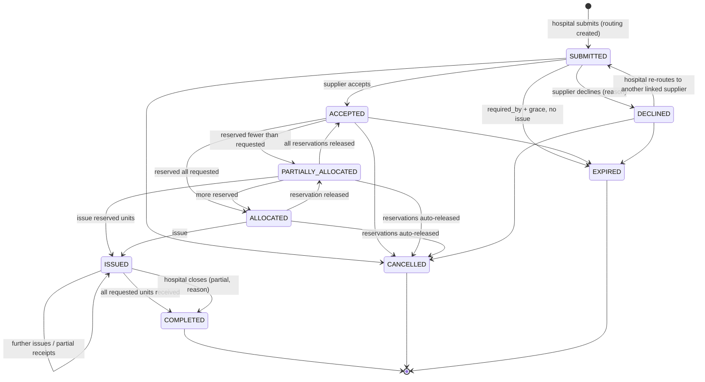
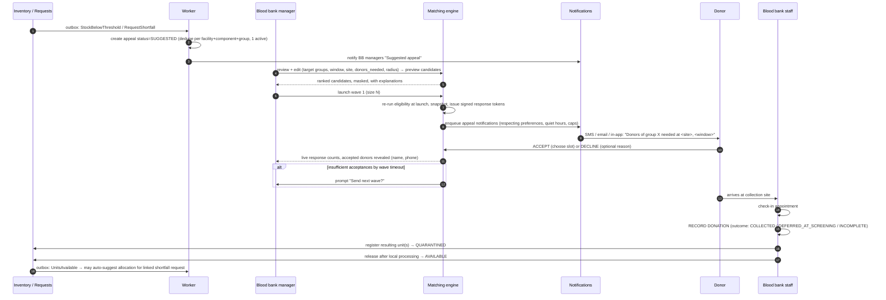
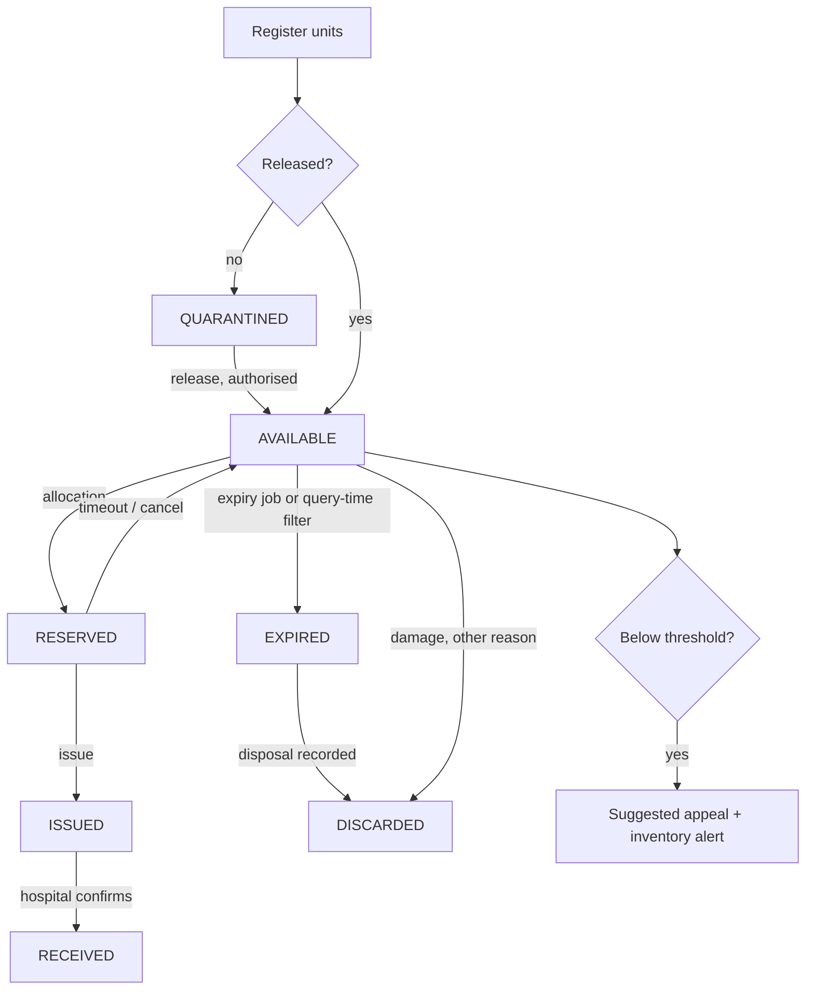

# 03 — Core Workflows

## G. Request lifecycle / state machine

### G.1 Request states
| State | Meaning | PDF mapping |
|---|---|---|
| `SUBMITTED` | Created and routed to a supplier; awaiting acceptance | pending |
| `ACCEPTED` | Supplier accepted responsibility; no units reserved yet | matched |
| `PARTIALLY_ALLOCATED` | Some units reserved, fewer than requested | matched |
| `ALLOCATED` | Reserved units ≥ requested | matched |
| `ISSUED` | At least one unit issued; awaiting receipt | matched |
| `COMPLETED` | Units received ≥ requested, **or** hospital closed as sufficiently fulfilled | completed |
| `DECLINED` | Current supplier declined and not yet re-routed | pending (re-routable) |
| `CANCELLED` | Hospital cancelled before completion | — |
| `EXPIRED` | `required_by` + grace passed with no issue; auto-closed | — |

Labels: states and transitions [PROPOSED]; the "pending → matched → completed" semantics [CONFIRMED].

### G.2 Transition rules [PROPOSED]
| Transition | Who (permission) | Guards | Side effects (same transaction) | Async (outbox) |
|---|---|---|---|---|
| create → SUBMITTED | `blood_request.create` @ requesting facility | facility VERIFIED & `can_request_blood`; supplier in active `supply_links`; supplier VERIFIED; component/urgency from ACTIVE rule sets; `units_requested` ≤ max; Idempotency-Key | routing PENDING; status history; audit; `submitted_at` | notify supplier staff (priority from urgency); schedule escalation job at `escalation_after_minutes` |
| SUBMITTED → ACCEPTED | `blood_request.respond` @ supplier | routing PENDING | routing ACCEPTED; `accepted_at` | notify requester; cancel escalation job |
| SUBMITTED → DECLINED | `blood_request.respond` @ supplier | reason code required | routing DECLINED | notify requester (HIGH) |
| DECLINED → SUBMITTED | `blood_request.route` @ requester | new supplier ≠ previously declined for this request | new routing PENDING | as create |
| reserve units | `allocation.manage` @ supplier | routing ACCEPTED; each unit AVAILABLE, not expired, at supplier facility, compatible per ACTIVE compatibility rule set (CONDITIONAL requires `confirm_conditional=true`); lock units `FOR UPDATE`; total reserved ≤ requested | allocation RESERVED; unit RESERVED + unit_event; request status recomputed; `first_allocated_at` | notify requester |
| release reservation | `allocation.manage` @ supplier, or system (timeout/cancel/expiry) | allocation RESERVED | allocation RELEASED; unit AVAILABLE (if not expired) | — |
| issue | `allocation.issue` @ supplier | allocation RESERVED; unit not expired **at issue time** | allocation ISSUED; unit ISSUED; `issued_at` | notify requester (HIGH) |
| confirm receipt | `blood_request.receive` @ requester | allocation ISSUED | allocation RECEIVED; unit RECEIVED, `current_facility_id` = hospital; request COMPLETED if received ≥ requested | notify supplier |
| close (partial) | `blood_request.close` @ requester | status ISSUED; reason code | COMPLETED; `completed_at` | notify supplier |
| cancel | `blood_request.cancel` @ requester | non-terminal; reason code; **if any unit is ISSUED, cancel is refused** — use close instead | release all RESERVED | notify supplier |
| expire | system job | non-terminal, no ISSUED allocations, `now > required_by + grace` | release reservations; `EXPIRED` | notify both |

Request status is **recomputed from allocations** by a single function (`requests.domain.recompute_status`) after allocation changes. This prevents drift between a stored status and the allocations underneath it (addresses master instruction §36).

### G.3 Concurrency & integrity [PROPOSED]
- Allocation runs in one transaction: `SELECT … FROM blood_units WHERE id = ANY(:ids) FOR UPDATE`, then re-validate every guard, then insert allocations (partial-unique index is the last line of defence) → `409 UNIT_UNAVAILABLE` for any failure.
- Request updates use `version` (optimistic locking); a stale version → `409 VERSION_CONFLICT`, and the UI refetches.
- The reservation timeout is `urgency_levels.reservation_hold_minutes`, enforced by a scheduled job plus a check at issue time. [VALIDATE AS-06: are time-limited reservations appropriate operationally?]

### G.4 Urgency [CONFIRMED configurable][VALIDATE AS-09]
Development placeholders (mock): `ROUTINE`, `PRIORITY`, `URGENT`, `CRITICAL`. Urgency influences: queue sort order, notification priority/channels, escalation timers, reservation hold time and dashboard prominence. **Urgency never bypasses any guard** (compatibility, verification, expiry, authorization).

---

## H. Donor mobilisation workflow [CONFIRMED decision 4]

### H.1 Sequence

### H.2 Key rules
| Rule | Label |
|---|---|
| A donor's **acceptance is an intent**, never a donation. Only staff-recorded `donations` count, and only released units count as supply | [CONFIRMED] |
| Appeals are **suggested by the system and launched by staff** (no automatic mass SMS) | [PROPOSED][VALIDATE AS-20] |
| One active or suggested appeal per (facility, component, target group) to prevent alert storms | [PROPOSED] |
| Target groups are **chosen by staff**; the system pre-fills from the ACTIVE compatibility rule set (groups whose products can serve the short group) | [PROPOSED][VALIDATE AS-11] |
| Eligibility is re-evaluated **at launch** and again **at check-in** (staff view); screening at the collection site remains authoritative | [CONFIRMED] (no bypass) |
| Donors with `REQUIRES_REVIEW` may be included only if the appeal sets `include_requires_review=true`; the message tells them screening will confirm | [PROPOSED][VALIDATE AS-21] |
| Before accepting, donors are masked to staff (initials, group, distance band, explanation). After accepting, staff see name and phone for coordination | [PROPOSED] privacy |
| Hospitals see only appeal status and counts (contacted / accepted / donated), never donor identities | [PROPOSED] |
| Response links: single-appeal scope, signed, expire at `window_end`; they allow only accept/decline/slot choice for that candidate. No login required, and the page shows no personal data beyond the donor's first name | [PROPOSED] |
| Cooldown: a donor is not contacted again within `APPEAL_CONTACT_COOLDOWN_HOURS` (config) or beyond their personal cap | [PROPOSED] |
| No-show and decline history influence ranking gently (see §J); they never exclude a donor permanently | [PROPOSED] |

### H.3 Appeal state machine
`SUGGESTED → DRAFT (staff edits) → ACTIVE (wave 1 launched) ⇄ PAUSED → CLOSED` (manual close or `window_end` passed); `SUGGESTED/DRAFT → CANCELLED`. Suggested appeals auto-dismiss if the stock recovers before launch.

### H.4 Appointment [PROPOSED][VALIDATE AS-24]
MVP uses slot choice within the appeal window (e.g., 30-min slots with a capacity per slot configured on the appeal). Walk-ins without appointments are supported at donation recording (appointment optional).

---

## I. Blood inventory workflow

### I.1 Registration paths
| Path | Initial status | Who | Label |
|---|---|---|---|
| A. Unit from a donation recorded in HemaNet | `QUARANTINED` | blood bank officer | [CONFIRMED] |
| B. Unit received from an external supplier (e.g., RBTC delivery) already released | `AVAILABLE` (requires `unit.register_released` permission) | officer | [PROPOSED][VALIDATE AS-04] |
| C. Bulk: scanner input or CSV of B-type receipts with a `batch_reference` | as B | officer | [PROPOSED] |
| D. Pilot opening balance: initial stock take | as B with event `OPENING_BALANCE` | manager | [PROPOSED] |

Registration validation [PROPOSED]:
- `unit_identifier` unique within `issuing_system`; duplicate → 409 (critical for double-count prevention).
- `expires_at` must be in the future at registration (unless recording an already-expired unit for disposal).
- Expiry plausibility: if the ACTIVE `COMPONENT_SPEC` gives a shelf life, `expires_at − collected_at` beyond that shelf life triggers a **warning requiring confirmation**, not a silent correction. The label is authoritative [VALIDATE AS-15].
- Bulk import is atomic: all rows valid or none committed, with a per-row error report.

### I.2 Daily operations

### I.3 Derived views [CONFIRMED decision 5]
- **Facility availability:** the `inventory_availability` view (counts by component × ABO × Rh, earliest expiry, `last_change`).
- **Network availability for hospitals:** aggregates for the hospital's linked suppliers only, showing *counts and `last_change`*, never unit IDs. The UI shows a freshness indicator and the text "Availability is indicative; confirm via request" [PROPOSED] (availability can be stale if staff update late — risk R-05).
- **Expiring soon:** units with `expires_at < now + component_spec.expiring_soon_window_hours`, sorted ascending, with a quick "prioritise for allocation" signal (FEFO).
- **Low stock:** `inventory_availability` joined to `stock_thresholds`.

### I.4 Scheduled jobs [PROPOSED]
| Job | Frequency | Action |
|---|---|---|
| `expire_units` | every 5 min | AVAILABLE/QUARANTINED/RESERVED with `expires_at ≤ now` → EXPIRED; releases affected allocations; alerts |
| `release_stale_reservations` | every 1 min | RESERVED past `reservation_expires_at` → release; notify both sides |
| `check_thresholds` | on inventory change events + hourly sweep | create or refresh SUGGESTED appeals and inventory alerts |
| `expiring_soon_digest` | daily 07:00 EAT | notify blood bank officers (in-app + email) |
| `expire_requests` | every 5 min | per §G.2 |
| `close_appeals` | every 5 min | past `window_end` → CLOSED |

### I.5 Reconciliation [PROPOSED][VALIDATE AS-32]
A stock-take screen lists AVAILABLE/QUARANTINED units per storage location. Staff mark each unit *present* or *missing*. Missing units need a manager-approved correction event with a reason. The result is a reconciliation record that shows how far system stock and physical stock have drifted, which is an important pilot metric. Tables: `stock_takes` (id, facility_id, started_by, started_at, completed_at, status) and `stock_take_items` (stock_take_id, unit_id, result PRESENT|MISSING|UNEXPECTED, resolved_by, correction_event_id). This is backlog priority P1 (late MVP) and is needed before the pilot.
