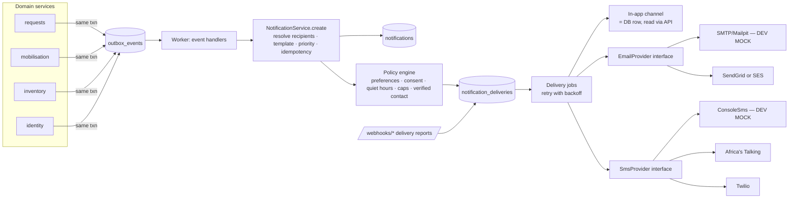

# 04 — Matching Engine & Notification Architecture

## J. Matching-engine design

### J.1 Principles
| Principle | Label |
|---|---|
| Deterministic, explainable, rule-driven. No ML in the MVP | [CONFIRMED] |
| Hard filters (safety) and soft ranking (convenience) are kept strictly separate. Ranking can never override a filter | [PROPOSED] |
| Every result carries a machine-readable explanation, rendered as human text | [CONFIRMED] |
| Pinned rule-set versions and eligibility snapshots make every match reproducible | [PROPOSED] |
| Pure functions over plain data (no DB access inside scoring) so they're unit-testable with golden files | [PROPOSED] |
| Matching *recommends*. A human allocates units and launches appeals | [PROPOSED][VALIDATE AS-20] |

There are two matchers under one `matching` module:

### J.2 Inventory matcher (fulfilment)
**Input:** request (component, recipient ABO/Rh, units outstanding), supplier facility.
**Pipeline:**
1. **Candidate query (SQL):** units at the supplier, `status='AVAILABLE'`, `expires_at > now()`, `component_id` = requested (component substitution is out of scope [VALIDATE AS-07]).
2. **Hard filter:** compatibility lookup in the ACTIVE `COMPATIBILITY` rule set (deny by default). CONDITIONAL rows are returned with a flag and require explicit confirmation.
3. **Order:** `preference_rank` ascending (e.g., identical group first, if the validated table says so), then `expires_at` ascending (FEFO), then `unit_identifier`.
   [VALIDATE AS-08: FEFO vs. clinical minimum remaining shelf life for certain patients/components]
4. **Explain:** per unit, e.g.
```json
{
  "unit_id": "…", "unit_identifier": "…",
  "compatibility": {"result": "COMPATIBLE", "preference_rank": 1, "rule_set": "COMPATIBILITY 2026.1 (VALIDATED)"},
  "expires_in_hours": 52,
  "reasons": ["IDENTICAL_GROUP_PREFERRED", "EARLIEST_EXPIRY_FIRST"]
}
```
5. Returns up to `units_outstanding × 2` suggestions. Staff select, then reserve (§G.2).

If the compatible available count is lower than the units outstanding, the response includes `shortfall: n`, and the UI offers "Create donor appeal from shortfall".

### J.3 Eligibility evaluator (used by donor matcher and donor dashboard)
- **Rule *types*** are implemented in code (`eligibility/rules/*.py`), each with a JSON-schema for its parameters. **Rule *values*** come from the ACTIVE `DONOR_ELIGIBILITY` rule set [CONFIRMED principle][VALIDATE AS-12].
- Inputs: DOB, (sex only if a validated rule needs it), donation history, active deferrals, blood-group confirmation status and the reference date (e.g., appeal window start).
- Output: `POTENTIALLY_ELIGIBLE | POTENTIALLY_INELIGIBLE | REQUIRES_REVIEW`, a list of reasons and `next_possible_date`.
- **Missing or unknown data → `REQUIRES_REVIEW`**, never ELIGIBLE. An unknown rule type or invalid parameters → the evaluator fails closed, logs an error and raises a platform alert.
- Language used everywhere: "potentially eligible — final eligibility is determined at screening".

### J.4 Donor matcher (mobilisation)
**Input:** appeal (target groups, collection facility location, radius, window, component, include_requires_review), wave size.

**Stage 1 — Candidate generation (SQL, fast, index-backed)**
- `donor_profiles` not deleted; `users.status = ACTIVE`; phone verified
- `abo, rh ∈ target groups`
- `availability = AVAILABLE` or `UNAVAILABLE` with `unavailable_until < window_start`
- has active consent for `APPEAL_NOTIFICATIONS`
- not already a candidate in this appeal; `last_contacted_at` older than the cooldown
- inside a bounding box around the collection facility, then precise haversine distance ≤ radius (SQL function). The implementation lives behind `geo.find_within_radius()` so PostGIS can replace it later (ADR-009)
- Donors without coordinates: included only if `county_id` = the facility's county, with distance marked `UNKNOWN_SAME_COUNTY` [PROPOSED][VALIDATE AS-25]

**Stage 2 — Hard filters (Python, rule-driven)**
- Eligibility evaluator → exclude `POTENTIALLY_INELIGIBLE`; include `REQUIRES_REVIEW` only if the appeal allows it
- `next_possible_date ≤ window_end`
- Contact caps (personal max per 30 days; platform default)

**Stage 3 — Transparent scoring** (weights in platform config, not clinical rule sets; they're operational, not clinical)

| Factor | Points (default, tunable) | Why |
|---|---|---|
| Distance | `max(0, 40 × (1 − d/radius))` | Closer donors can arrive sooner |
| Blood group lab-confirmed | +15 | Less risk of wasted trips from a wrong self-reported group |
| Identical group to the shortage (per rule-set `preference_rank` = 1) | +10 | Operational preference |
| Response history (accept rate over last 5 contacts, Laplace-smoothed) | 0–15 | Likely to respond |
| Show-up history (appointments completed / accepted, smoothed) | 0–10 | Likely to arrive |
| Rest since last contact (fairness) | 0–10, increasing with days since `last_contacted_at` | Spreads the load and reduces fatigue for top donors |
| Eligibility REQUIRES_REVIEW | −10 | Prefer clearer candidates |

Score = sum of factors. Ties are broken by distance, then by a stable per-appeal random hash so no donor is systematically favoured.
Every factor's contribution is stored in `appeal_candidates.explanation`:

```json
{
  "score": 71.5,
  "hard_filters": ["GROUP_TARGETED:O+", "ELIGIBILITY:POTENTIALLY_ELIGIBLE", "WITHIN_RADIUS", "CONSENTED", "NOT_IN_COOLDOWN"],
  "factors": [
    {"code": "DISTANCE", "value_km": 4.2, "points": 31.6},
    {"code": "BLOOD_GROUP_LAB_CONFIRMED", "points": 15},
    {"code": "IDENTICAL_GROUP", "points": 10},
    {"code": "RESPONSE_HISTORY", "value": "3/5", "points": 8.9},
    {"code": "REST_SINCE_LAST_CONTACT", "value_days": 61, "points": 6.0}
  ],
  "rule_sets": {"eligibility": "…", "compatibility": "…"},
  "matcher_version": "donor-matcher/1.0.0"
}
```
Rendered for staff as: *"Compatible group (O+, lab-confirmed) · Potentially eligible · 4.2 km away · Responded to 3 of last 5 appeals · Last contacted 61 days ago."*

**Stage 4 — Waves:** the top N not yet contacted go into the wave. The rest stay as previewed candidates for later waves.

**Fairness and risk notes [PROPOSED]:** we'll monitor contact distribution across donors and counties in reports. The rest factor exists to prevent "always ping the same 50 donors". Blood groups are never used to prioritise donors beyond what the validated compatibility preference says.

### J.5 Performance
At pilot scale (≤ 50k donors), stage 1 with composite indexes on `(abo, rh, availability)` plus lat/long bounding-box filtering is milliseconds. Matching runs **as a job** at launch (it's not on the request path) and writes candidates. Preview runs synchronously with a limit.

### J.6 Hospital "view donors" (PDF) [CONFIRMED, modified for privacy — PROPOSED]
Hospitals see: *"Registered donors of compatible groups within the supplier's area: 50–100 (potentially eligible)"*, in bands, never lists. Counts under 10 display as "fewer than 10", to avoid re-identification.

---

## K. Notification architecture [CONFIRMED subsystem]

### K.1 Components


### K.2 Rules
| Rule | Label |
|---|---|
| Route handlers never call providers. They change domain state, and events trigger notifications | [CONFIRMED] |
| One `notification` per recipient per event; one `delivery` per channel | [PROPOSED] |
| `idempotency_key = event_id + recipient + template` ⇒ a retried handler never double-sends | [PROPOSED] |
| Templates versioned in code (`notifications/templates/{code}/{lang}.{channel}.txt`), rendered with an allow-listed variable set. **Payload validation rejects any field not in the template's schema**, which stops PHI leaking into SMS | [PROPOSED] |
| SMS body ≤ 160 GSM-7 characters where possible; the link uses a short HemaNet domain path | [PROPOSED] |
| Retries: exponential backoff (30 s, 2 m, 10 m, 30 m, 2 h), max 5; then `FAILED` + admin dashboard counter. Permanent errors (invalid number) → `UNDELIVERABLE` straight away | [PROPOSED] |
| Priority → channels: CRITICAL/HIGH: in-app + SMS + email (if enabled); NORMAL: in-app + email; LOW: in-app only (mapping configurable) | [PROPOSED][VALIDATE AS-26] |
| Quiet hours are respected for donor appeals except where the urgency level has `bypass_quiet_hours=true` **and** the donor opted in to urgent night alerts | [PROPOSED] |
| Opt-out is always respected, including for critical alerts. Account-security messages are exempt | [PROPOSED] |
| Unverified contact → delivery `SUPPRESSED(UNVERIFIED_CONTACT)` | [PROPOSED] |
| Provider failover: if the primary SMS provider returns 5xx/timeouts beyond a threshold, route to the secondary if one is configured | [PROPOSED] (config only in MVP) |
| Dev environment: SMS goes to the console/log, email to Mailpit. UI deliveries show "DEVELOPMENT MOCK — not sent" | [CONFIRMED] mock labelling |
| Webhook endpoints verify provider signatures or shared secrets and are idempotent | [PROPOSED] |
| Sender ID / short code registration and bulk-SMS compliance in Kenya | [VALIDATE AS-27] |

### K.3 Escalation [PROPOSED][VALIDATE AS-10]
```
RequestSubmitted
  └─ schedule job escalate_request(request_id, level=1) at submitted_at + urgency.escalation_after_minutes
escalate_request:
  if routing still PENDING:
     level 1 → notify all BLOOD_BANK_MANAGER members of supplier (HIGH/CRITICAL)
               schedule level 2 at + escalation_after_minutes
     level 2 → notify requester ("no response yet — consider re-routing") + PLATFORM_ADMIN
  else: no-op
AppealWaveLaunched
  └─ schedule check_wave at + wave_response_window
check_wave: if accepted < donors_needed → notify manager "Send next wave?" (no automatic send in MVP)
```
Escalation never auto-routes a request to another blood bank and never auto-sends new waves. Both are human decisions in the MVP.

### K.4 Notification catalogue (MVP)
| Template code | Recipients | Priority |
|---|---|---|
| `request.submitted` | supplier officers/managers | from urgency |
| `request.accepted` / `request.declined` | requesting facility members | NORMAL / HIGH |
| `request.units_issued` | requester | HIGH |
| `request.escalation` | supplier managers, admin | HIGH/CRITICAL |
| `request.expired` / `request.cancelled` | both sides | NORMAL |
| `inventory.low_stock` | supplier managers | NORMAL/HIGH |
| `inventory.expiring_digest` | supplier officers | LOW |
| `inventory.reservation_expired` | both sides | HIGH |
| `appeal.suggested` | managers | NORMAL |
| `appeal.invitation` | donors | from urgency |
| `appeal.response_confirmation` | donor | NORMAL |
| `appeal.reminder` | accepted donors, 2 h before slot | NORMAL |
| `account.*` (verify, reset, new sign-in, membership invite) | user | HIGH (security) |
| `facility.verification_decision` | facility admin | NORMAL |
