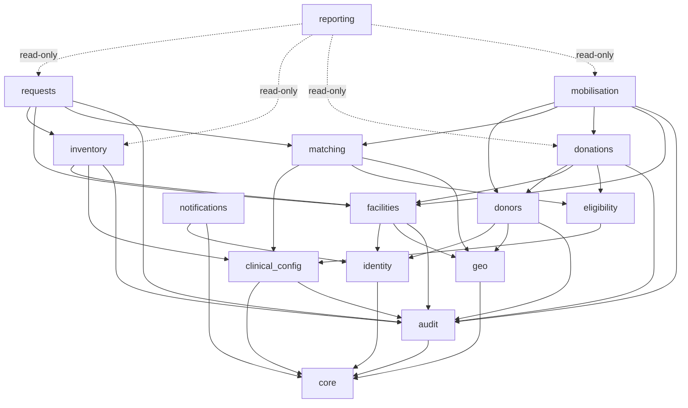

# 07 — Frontend Route Map & Backend Module Map

## O. Frontend route map

### O.1 Frontend stack [PROPOSED; each dependency justified]
| Dependency | Reason |
|---|---|
| React 18+ with TypeScript (`strict`) | [CONFIRMED] |
| Vite | Fast builds, simple config, first-class TS |
| React Router (data routers) | Nested role layouts, route-level code splitting, loaders for guards |
| TanStack Query | Server-state cache, polling (ADR-012), invalidation, retry; avoids a global state library |
| react-hook-form + zod | Accessible, performant forms; zod mirrors server validation **for UX only** |
| Tailwind CSS | Consistent design tokens; small CSS output |
| Radix UI primitives (or shadcn/ui built on them) | Accessible dialogs, menus and tabs without writing ARIA by hand |
| openapi-typescript + openapi-fetch | Types generated from the backend OpenAPI spec, so no hand-written DTO drift |
| react-i18next | Externalised strings from day one (NFR-I1) |
| date-fns-tz | Display in Africa/Nairobi |
| Vitest, Testing Library, MSW, Playwright, axe-core | Tests (§S) |

**Not added:** Redux/Zustand (server state covers our needs), chart libraries until the reports need them (then one small library), a map SDK in the MVP (a static link to Maps for directions suffices; a picker can come later) [PROPOSED].

### O.2 Routes
Layouts: `PublicLayout`, `DonorLayout`, `FacilityLayout` (facility switcher when the user has more than one membership), `AdminLayout`. Guards check authentication and permissions from `/me/memberships`, for UX only.

| Path | Page | Role | Label |
|---|---|---|---|
| `/` | Landing: what HemaNet is, prototype disclaimer | public | [PROPOSED] |
| `/login`, `/login/mfa` | Sign in | public | [CONFIRMED] |
| `/register/donor` | Donor registration (multi-step: account → profile → consent → phone OTP) | public | [CONFIRMED] |
| `/register/facility` | Facility registration | public | [CONFIRMED] |
| `/verify-phone`, `/verify-email/:token` | Verification | public/auth | [PROPOSED] |
| `/forgot-password`, `/reset-password/:token` | Reset | public | [PROPOSED] |
| `/invite/:code` | Staff invite acceptance | public | [PROPOSED] |
| `/r/:token` | Donor appeal response via SMS/email link (no login) | public | [PROPOSED] |
| `/privacy`, `/terms` | Legal notices | public | [PROPOSED][VALIDATE] |
| `/select-facility` | Choose the active facility context | staff | [PROPOSED] |
| `/account`, `/account/security` | Profile, password, MFA, sessions | all | [PROPOSED] |
| `/notifications` | Inbox | all | [CONFIRMED] |
| **Donor** | | | |
| `/donor` | Dashboard: eligibility card (3-state + next date), active appeals, upcoming appointment, impact summary (donations count) | donor | [CONFIRMED] |
| `/donor/appeals`, `/donor/appeals/:appealId` | Alerts and accept/decline + slot | donor | [CONFIRMED] |
| `/donor/appointments` | Upcoming/past | donor | [PROPOSED] |
| `/donor/donations` | History | donor | [CONFIRMED] |
| `/donor/profile` | Profile, blood group (source badge), location, availability | donor | [CONFIRMED] |
| `/donor/preferences` | Channels, quiet hours, cap, consents | donor | [PROPOSED] |
| **Hospital** (`/f/:facilityId/…` when the facility can request blood) | | | |
| `/f/:fid/hospital` | Dashboard: open requests by urgency with age timers, recent updates, supplier availability snapshot | requester | [CONFIRMED] |
| `/f/:fid/requests` | List with filters | requester | [CONFIRMED] |
| `/f/:fid/requests/new` | Request form with live availability panel | requester | [CONFIRMED] |
| `/f/:fid/requests/:rid` | Detail: status stepper, timeline, units issued/received, appeal summary, actions | requester | [CONFIRMED] |
| `/f/:fid/availability` | Network availability of linked suppliers | requester | [CONFIRMED] |
| **Blood bank** (when the facility can hold inventory) | | | |
| `/f/:fid/blood-bank` | Dashboard: incoming queue by urgency, low-stock alerts, expiring within window, suggested appeals, today's appointments | officer/manager | [CONFIRMED] |
| `/f/:fid/incoming` | Incoming request queue | officer | [CONFIRMED] |
| `/f/:fid/incoming/:rid` | Accept/decline, allocation suggestions, reserve, issue | officer | [CONFIRMED] |
| `/f/:fid/inventory` | Availability matrix (component × group), drill-down to units | officer | [CONFIRMED] |
| `/f/:fid/inventory/units` | Unit list + filters | officer | [CONFIRMED] |
| `/f/:fid/inventory/units/new` | Register (single/scan mode) | officer | [CONFIRMED] |
| `/f/:fid/inventory/import` | CSV import with dry-run | officer | [PROPOSED] |
| `/f/:fid/inventory/units/:uid` | Unit detail + chain of custody | officer | [CONFIRMED] |
| `/f/:fid/inventory/expiring` | Expiring soon | officer | [CONFIRMED] |
| `/f/:fid/inventory/stock-takes`, `/…/:stid` | Reconciliation | officer/manager | [PROPOSED] |
| `/f/:fid/thresholds` | Low-stock thresholds | manager | [PROPOSED] |
| `/f/:fid/donations`, `/f/:fid/donations/new` | Record donation (lookup donor → eligibility check → outcome → register units) | officer | [CONFIRMED] |
| `/f/:fid/appointments` | Today's check-in list | officer | [PROPOSED] |
| `/f/:fid/appeals`, `/f/:fid/appeals/new`, `/f/:fid/appeals/:aid` | Appeals: edit, preview with explanations, waves, responses | manager | [CONFIRMED] |
| **Any facility** | | | |
| `/f/:fid/staff` | Memberships & invites | hospital admin / BB manager | [PROPOSED] |
| `/f/:fid/settings` | Facility profile, storage locations, supply links (read-only) | admin/manager | [PROPOSED] |
| `/f/:fid/reports` | Facility reports | staff | [CONFIRMED] |
| **Admin** | | | |
| `/admin` | Network overview: open requests by urgency, unacknowledged escalations, shortages, delivery failures, pending verifications | admin | [CONFIRMED] |
| `/admin/facilities`, `/admin/facilities/:id` | Verification queue / detail | admin | [CONFIRMED] |
| `/admin/supply-links` | Manage links | admin | [PROPOSED] |
| `/admin/users`, `/admin/users/:id` | Users | admin | [CONFIRMED] |
| `/admin/rule-sets`, `/admin/rule-sets/:id` | Clinical configuration lifecycle, diff, validation record | admin / approver | [PROPOSED] |
| `/admin/notifications` | Delivery health | admin | [PROPOSED] |
| `/admin/audit` | Audit viewer + chain verification | admin | [CONFIRMED] |
| `/admin/reports` | Network reports | admin | [CONFIRMED] |

### O.3 UX rules [PROPOSED]
- **Urgency visibility:** each urgency has a colour **plus** an icon and text label (never colour alone), and the elapsed time since submission is shown next to it. CRITICAL items pin to the top.
- **Global banners:** "Development system: clinical rules are DEVELOPMENT MOCK / PENDING VALIDATION" whenever any active rule set isn't validated; "Offline / data may be stale" when polling fails.
- **Freshness:** availability shows "updated 3 min ago".
- **Empty states** explain what to do next ("No units registered yet. Register units or import a delivery").
- **Error states** show the `request_id` for support.
- **Forms:** labels always visible; errors in text linked by `aria-describedby`; focus moves to the error summary on submit; an `aria-live` region announces async status.
- **Mobile-first layouts:** donors mainly use phones. Staff dashboards must work on a tablet.

### O.4 Frontend structure
```
frontend/src/
  app/            # providers (QueryClient, i18n, router), error boundary
  routes/         # route tree, guards
  layouts/
  features/
    auth/ donor/ hospital/ blood-bank/ admin/ inventory/ requests/ appeals/ notifications/ reports/ facilities/ rule-sets/
      api.ts (typed hooks)  components/  pages/  schemas.ts (zod)  __tests__/
  components/     # shared design-system components (Button, StatusBadge, UrgencyBadge, DataTable, Stepper…)
  services/       # api client (openapi-fetch), auth token manager, refresh logic
  types/          # generated openapi types (do not edit)
  constants/ utils/ hooks/ i18n/ (en.json, sw.json)
```

---

## P. Backend module map

### P.1 Structure change vs the suggested layout (per master instruction §39)
- **Current (suggested):** layer-first top-level folders (`models/`, `routes/`, `services/`, `repositories/`) *and* domain folders (`donors/`, `inventory/`…) side by side.
- **Problem:** mixing the two means every feature touches 5 top-level folders, and domain boundaries blur because any service can import any model.
- **Proposed:** **domain-first modules** with the same internal layers inside each module, plus a thin shared core.
- **Impact:** only folder organisation changes; the layers still exist. **Migration:** none (no code exists yet).

```
backend/
├── app/
│   ├── __init__.py            # create_app() factory
│   ├── config.py              # typed settings from env (pydantic-settings), per-environment
│   ├── extensions.py          # db, migrate, api (flask-smorest), limiter
│   ├── core/                  # shared kernel (no domain logic)
│   │   ├── errors.py          # exception types → error envelope
│   │   ├── authz.py           # require_permission, Scope, policy registry
│   │   ├── idempotency.py
│   │   ├── pagination.py
│   │   ├── outbox.py          # publish_event() within current txn
│   │   ├── clock.py           # injectable now() for tests
│   │   ├── logging.py         # structlog JSON, redaction filter, request id
│   │   └── security_headers.py
│   ├── modules/
│   │   ├── identity/          # users, auth, tokens, MFA, OTP, roles/permissions, memberships
│   │   ├── facilities/        # facilities, verification, supply links, storage locations
│   │   ├── geo/               # counties, distance (haversine now, PostGIS later)
│   │   ├── clinical_config/   # rule sets, components, compatibility/eligibility/spec/urgency entries
│   │   ├── donors/            # profiles, consents, preferences, deferrals, blood-group confirmation
│   │   ├── eligibility/       # evaluator + rule-type implementations (pure)
│   │   ├── donations/         # donation recording
│   │   ├── inventory/         # units, unit state machine, events, availability, thresholds, stock takes
│   │   ├── requests/          # blood requests, routing, allocations, request state machine
│   │   ├── matching/          # inventory matcher, donor matcher, scoring, explanations (pure core)
│   │   ├── mobilisation/      # appeals, waves, candidates, responses, appointments, response links
│   │   ├── notifications/     # service, policy, templates, providers/, webhooks
│   │   ├── audit/             # audit writer, hash chain, viewer, verifier
│   │   └── reporting/         # read-only report queries
│   ├── jobs/                  # job registry, scheduler definitions, worker loop
│   └── integrations/          # placeholder README only (FHIR/DHIS2/KMHFL later)
├── migrations/                # Alembic
├── seeds/
│   ├── reference/             # counties, components, reason codes, roles/permissions (safe for all envs)
│   └── development_mock/      # MOCK rule sets, demo facilities/donors — refused outside dev
├── tests/                     # unit/ integration/ api/ authz/ concurrency/ migrations/
├── wsgi.py                    # api entry
├── worker.py                  # worker entry
├── pyproject.toml             # (dependencies pinned via lock file)
└── Dockerfile
```

Inside each module:
```
modules/requests/
  models.py        # SQLAlchemy models (owned by this module only)
  schemas.py       # marshmallow request/response schemas (API boundary)
  repository.py    # scoped queries; no business rules
  domain/          # pure logic: state_machine.py, recompute_status.py (no Flask, no DB)
  service.py       # use cases: transaction boundary, authz-aware, emits events, writes audit
  policies.py      # permission + scope rules for this module's resources
  routes.py        # thin HTTP layer: parse → service → serialize
  events.py        # event type definitions
  handlers.py      # outbox event handlers (worker side)
```

### P.2 Module dependency rules [PROPOSED; enforced with `import-linter` in CI]

- `routes` → `service` → `repository`/`domain`. Routes never touch models directly.
- Modules call each other **only through `service.py` public functions** or through events. They never import another module's models or repositories.
- `matching` and `eligibility` domain code is pure (inputs in, results out), which makes it testable and reusable in future batch analytics.
- Notifications are triggered only by outbox events handled in `notifications/handlers.py`, so there's no import from domain modules into providers.

### P.3 Backend dependencies [PROPOSED; each with a reason]
| Package | Reason |
|---|---|
| Flask 3, flask-smorest, marshmallow | [CONFIRMED] Flask; smorest provides blueprints, validation and OpenAPI generation |
| SQLAlchemy 2, Alembic (Flask-Migrate), psycopg 3 | ORM + migrations + Postgres driver |
| argon2-cffi | Password hashing |
| PyJWT | Access tokens |
| pyotp | TOTP |
| pydantic-settings | Typed env configuration |
| structlog | Structured logs |
| Flask-Limiter | Application rate limits |
| phonenumbers | E.164 validation |
| sentry-sdk (with scrubbing) or a self-hosted equivalent | Error tracking [VALIDATE AS-40 data transfer] |
| gunicorn | WSGI server |
| pytest, pytest-cov, factory-boy, hypothesis, freezegun (or core.clock) | Tests |
| ruff, mypy, bandit, pip-audit, import-linter | Quality gates |
| Provider SDKs (Africa's Talking / Twilio / SendGrid) | Only inside `notifications/providers/`; or plain HTTPS via `httpx` to limit dependencies |
