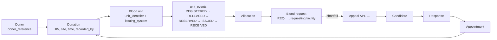

# 08 — Q. Audit and Traceability Model

HemaNet keeps two complementary append-only records. Both are [CONFIRMED] requirements (master instruction §24, decision 5); their design is [PROPOSED].

| | `audit_events` | `unit_events` |
|---|---|---|
| Question answered | *Who did what, when, from where, and was it allowed?* | *Where has this unit been, and what happened to it?* |
| Scope | All security-relevant and business-significant actions, including **denied** attempts | Blood-unit lifecycle only (chain of custody) |
| Consumers | Admins, investigations, compliance | Blood bank staff, recalls (future), traceability |
| Written by | `audit.record()` in services and the authz layer | Inventory state machine |

## Q.1 `audit_events` schema
| Column | Notes |
|---|---|
| id bigint identity PK | monotonic order |
| occurred_at timestamptz | server clock |
| actor_type enum (USER, SYSTEM, WORKER, PROVIDER_WEBHOOK) | |
| actor_user_id uuid null | |
| actor_facility_id uuid null | acting facility context |
| action text | controlled vocabulary, e.g. `blood_request.created`, `unit.released`, `rule_set.activated`, `auth.login_failed`, `authz.denied` |
| outcome enum (SUCCESS, DENIED, FAILED) | |
| entity_type, entity_id | |
| request_id text | correlates with logs |
| ip_prefix_hash text, user_agent_family text | minimal technical context |
| changes jsonb null | field-level `{field: [old, new]}` for allow-listed non-sensitive fields; sensitive fields are recorded as `"<changed>"` |
| metadata jsonb null | e.g. reason code, rule-set version |
| prev_hash bytea, hash bytea | `hash = SHA-256(prev_hash ‖ canonical_json(row without hash))` |

Indexes: (entity_type, entity_id, id), (actor_user_id, id), (action, occurred_at), (occurred_at).

## Q.2 Immutability [PROPOSED, ADR-011]
1. The application DB role has `INSERT, SELECT` only on `audit_events` and `unit_events`. Migrations run as a separate owner role.
2. A `BEFORE UPDATE OR DELETE` trigger raises an exception, as a backstop against accidental grants.
3. Hash chain: inserts are serialised through a single-row chain-head lock (`SELECT … FOR UPDATE` on `audit_chain_head`). That's acceptable at pilot write volumes; if contention appears, move to per-partition chains.
4. The `verify-chain` endpoint and a nightly job recompute hashes and alert on mismatch.
5. [FUTURE] Periodically anchor the latest hash externally (e.g., write it to write-once object storage, or email a digest to a designated officer). This gives tamper-evidence without blockchain.
6. Retention: ≥ 7 years placeholder [VALIDATE AS-41]. Archive older partitions to encrypted object storage; the chain is preserved across archives.

## Q.3 Mandatory audit actions (MVP)
| Domain | Actions |
|---|---|
| Auth | login success/failure, MFA enroll/disable, password change/reset, token-family reuse detected, session revoked |
| Authz | every `DENIED` decision on a protected endpoint (sampled if volume is abusive) |
| Identity | user suspended/reactivated, platform role granted/revoked, membership invited/activated/role-changed/revoked |
| Facilities | registered, verification decision (method, evidence ref), supply link changed, threshold changed |
| Clinical config | rule set created, entries changed, submitted, validation recorded, activated, retired |
| Donors (staff actions) | donor lookup (who looked up whom), blood group confirmed, deferral recorded/lifted, donation recorded/corrected |
| Donors (self) | consent granted/withdrawn, profile blood group changed, data export requested, deactivation |
| Inventory | unit registered (single/bulk with count), released, quarantined, discarded, corrected, stock-take completed |
| Requests | created, routed, accepted, declined, allocation reserved/released, issued, received, cancelled, closed, expired |
| Mobilisation | appeal created/edited/launched/wave sent/paused/closed, candidate revealed (identity viewed), check-in, no-show |
| Notifications | manual retry; provider switch |
| Reports | CSV export (report name, filters) |

## Q.4 Traceability chain

From a unit, staff can trace forward (which request/facility received it) and backward (which donation and donor, visible only to collection-site staff with permission). That's the foundation for recalls [FUTURE] and donor-impact messaging [FUTURE][VALIDATE AS-43].

The request side stops at the hospital's receipt. Patient-level linkage (which patient was transfused) is **deliberately outside HemaNet** in the MVP. It belongs in hospital systems, and any future integration must be validated for privacy and legal basis.

## Q.5 `unit_events` event types
`REGISTERED`, `OPENING_BALANCE`, `RELEASED`, `QUARANTINED`, `RESERVED`, `RESERVATION_RELEASED`, `ISSUED`, `RECEIVED`, `EXPIRED`, `DISCARDED`, `CORRECTED`, `STOCK_TAKE_CONFIRMED`, `STOCK_TAKE_MISSING`, and reserved for the future: `TRANSFER_DISPATCHED`, `TRANSFER_RECEIVED`, `LABEL_PRINTED`, `TEMPERATURE_EXCURSION`, `RECALLED`, `FINAL_DISPOSITION_RECORDED`.
