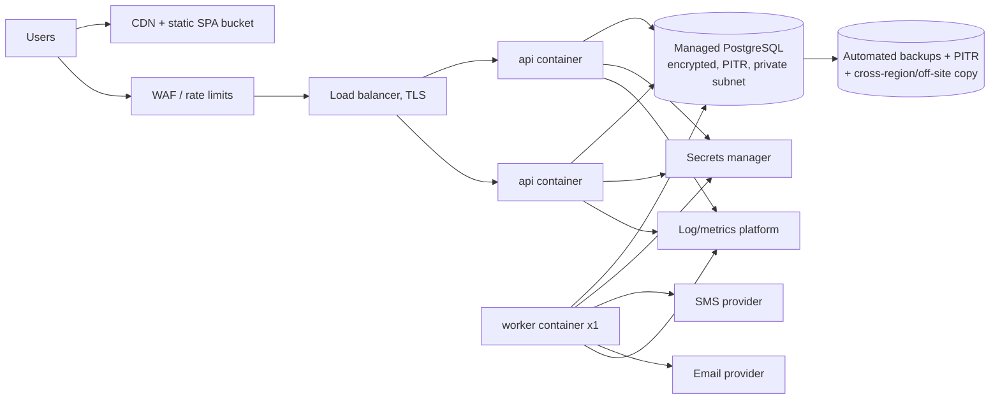

# 09 — Testing, Deployment, Monitoring, Disaster Recovery

## S. Testing strategy [CONFIRMED mandatory; PROPOSED design]

### S.1 Layers
| Layer | Tooling | What | Gate |
|---|---|---|---|
| Pure domain unit tests | pytest, hypothesis | State machines (request, unit, appeal), eligibility evaluator per rule type, compatibility lookup, scoring, explanation rendering, status recomputation | Every PR |
| Service/integration tests | pytest + **real PostgreSQL** (Docker/Testcontainers; not SQLite, because constraints, locking and partial indexes matter) with transaction rollback per test | Use cases end-to-end within the backend, including outbox events and audit writes | Every PR |
| API tests | Flask test client | Status codes, error envelope, validation, pagination, idempotency, `If-Match` | Every PR |
| **Authorization matrix** | parametrised from a YAML copy of §M | Every endpoint × every role × {own facility, other facility, unverified facility, suspended membership, anonymous} | Every PR; CI fails if an endpoint isn't in the matrix |
| Concurrency | pytest with threads/processes against Postgres | Double allocation of one unit; simultaneous issue and expiry; concurrent response-link submissions; idempotency races | Every PR (fast subset), nightly (full) |
| Migration tests | Alembic | upgrade head from empty; downgrade/upgrade the last migration; upgrade on a seeded snapshot; model/migration drift check | Every PR |
| Job tests | injectable clock | expiry, reservation timeout, escalation, threshold → suggested appeal | Every PR |
| Notification tests | fake providers | template variable allow-list (PHI guard), retries/backoff, permanent failure, suppression reasons, webhook signature failures | Every PR |
| Frontend component | Vitest + Testing Library + MSW | forms (validation, error announcements), status badges, guards, token refresh | Every PR |
| Accessibility | vitest-axe on components; @axe-core/playwright on pages | zero serious/critical violations | Every PR |
| E2E | Playwright against docker-compose stack with dev mock providers | Critical workflows below | Every PR (smoke), nightly (full) |
| Security | bandit, semgrep, pip-audit, npm audit, gitleaks; OWASP ZAP baseline on staging | | PR + weekly |
| Performance | k6 | request queue, availability, matching preview at pilot data volumes (NFR-PF1) | Before pilot, then monthly |
| Restore test | scripted | restore the latest backup into an isolated environment, run smoke tests | Quarterly (§V) |

Coverage: ≥ 90% line/branch on `domain/` packages of `inventory`, `requests`, `matching`, `eligibility`, `mobilisation`, `identity`; no vanity global target.

### S.2 Critical E2E workflows
1. Donor registers → verifies phone → sees eligibility "Requires review" (no history, self-reported group) with an explanation.
2. Facility registers → admin verifies → manager invites officer → officer activates.
3. Hospital creates URGENT RBC request → supplier accepts → allocation suggestions (explained) → reserve 2 → issue → hospital confirms receipt → COMPLETED; timeline and audit correct.
4. Request with a shortfall → appeal from shortfall → preview → launch wave → donor (via link) accepts slot → staff check-in → record donation → register unit (QUARANTINED) → release → allocate to the original request.
5. Donor declines; donor cooldown prevents re-contact; next wave excludes them.
6. Low-stock threshold breach → suggested appeal visible to manager, no SMS sent automatically.
7. Rule set lifecycle: draft → submit → validation recorded → activate (MFA step-up) → banner disappears.

### S.3 Dangerous cases (explicit test list)
| Case | Expected |
|---|---|
| Incompatible unit selected (per active rule set) | 422 `INCOMPATIBLE_UNIT`; nothing reserved |
| No row in compatibility table | Treated as incompatible |
| No ACTIVE rule set / ACTIVE is a dev mock in pilot env | 422 `NO_ACTIVE_VALIDATED_RULE_SET`; matching/eligibility disabled with a clear UI |
| Ineligible donor | Not in candidates; explanation available to staff on lookup |
| Unknown DOB / blood group | REQUIRES_REVIEW, never ELIGIBLE |
| Expired unit (job not yet run) | Excluded from suggestions; reserve/issue refused |
| Unit expires while RESERVED | Job releases the allocation; request recomputed; both sides alerted |
| Insufficient inventory | `shortfall` reported; partial allocation allowed; request PARTIALLY_ALLOCATED |
| Duplicate request submit (double click / retry) | Idempotency returns the same 201 body |
| Duplicate unit identifier | 409 |
| Duplicate donation record (same appointment/DIN) | 409 |
| Two officers reserve the same unit concurrently | Exactly one succeeds; the other gets 409 `UNIT_UNAVAILABLE` |
| Cancel after issue | 409; must use close |
| Officer at bank B views a request routed to bank A | 404 |
| Hospital user reads unit list | 403/404 |
| Donor opens another donor's appeal response link token | Token bound to candidate; invalid → 404 |
| Suspended user with a valid access token | Rejected on the next request (token_version check) |
| Revoked membership | Loses facility access immediately |
| Refresh token reuse | Family revoked; security notification |
| Expired/invalid JWT, tampered signature, `alg:none` | 401 |
| Malicious input (SQLi strings, XSS payloads in notes, oversized bodies, unicode tricks in phone numbers) | Rejected or safely stored and escaped on render |
| Unknown JSON fields (e.g., `"eligible": true`, `"status": "COMPLETED"`) | 400 `UNKNOWN_FIELD` |
| SMS provider timeout / 5xx | Retries with backoff → FAILED after max; in-app still delivered; admin counter increments |
| Email provider down | Same |
| DB unavailable | 503 with `request_id`; readiness probe fails; no partial writes (transactions) |
| Worker down | `/readyz` reports stale heartbeat; alert; jobs resume without loss |
| Clock skew / timezone | All comparisons in UTC; display tests for EAT |
| Appeal launched twice (double click) | Idempotency; single wave |
| Donor opted out | Delivery SUPPRESSED, including CRITICAL |
| PHI accidentally in notes | Excluded from notifications and logs (tested redaction) |

## T. Deployment architecture [PROPOSED; hosting location pending AS-40]

### T.1 Environments
| Env | Purpose | Data | Providers |
|---|---|---|---|
| local | development | development-mock seeds only | Mailpit, console SMS (DEVELOPMENT MOCK) |
| ci | automated tests | ephemeral | fakes |
| staging | pre-release verification, stakeholder demos | synthetic data only; **never real donor data** | sandbox providers |
| pilot/production | real use | real | real providers; `REQUIRE_VALIDATED_RULES=true` |

### T.2 Local
`docker compose up` → `postgres:16`, `api`, `worker`, `frontend` (Vite dev server), `mailpit`. The `make seed-dev` command loads reference and development-mock seeds; it refuses to run if `APP_ENV` isn't `local`.

### T.3 Hosted (pilot) — portable container design (ADR-015)

- **The option in the PDF (AWS):** ECS Fargate (or EC2 running containers, per the PDF), RDS PostgreSQL, S3 + CloudFront for the SPA, Secrets Manager, CloudWatch. **Region:** AWS has no Kenyan region. The nearest is `af-south-1` (Cape Town). If Kenyan law requires in-country storage or processing of this health data, AWS alone may not comply [VALIDATE AS-40].
- **The in-Kenya option:** a Kenyan data centre or cloud provider running the same containers, managed or self-operated PostgreSQL, and an S3-compatible object store. The application uses **no provider-proprietary services in its core** (no SQS, Lambda or DynamoDB), so switching between these options is a deployment change only.
- Pilot sizing: 2 small API instances, 1 worker, a DB with 2 vCPU / 4–8 GB RAM, Multi-AZ/HA if the budget allows (otherwise single instance + PITR, with an RTO accepted by stakeholders).
- **Migrations** run as a one-off release task before new API containers start. They must be backward-compatible (expand → migrate → contract) so a rollback doesn't need a DB rollback.

### T.4 CI/CD (GitHub Actions or equivalent)
1. PR: ruff, mypy, eslint, tsc, unit/integration/API/authz tests with a Postgres service, frontend tests, axe, migration tests, security scans, OpenAPI diff (breaking-change detection), build images.
2. Merge to `main` → deploy to staging automatically → E2E smoke suite.
3. Production/pilot → manual approval, tagged release, migration task, rolling deploy, post-deploy smoke tests, automatic rollback on failed health checks.
4. Images are signed and scanned; SBOM generated.

## U. Monitoring and logging [PROPOSED]
| Signal | Implementation | Alert |
|---|---|---|
| Structured logs | structlog JSON: timestamp, level, request_id, user_id (UUID only), facility_id, route, status, latency. **Redaction filter** drops names, phones, emails, notes, tokens | — |
| Errors | Sentry-compatible error tracking with PII scrubbing (self-hosted or region-appropriate) [VALIDATE AS-40] | New error types; error-rate spike |
| API metrics | p50/p95/p99 latency, 4xx/5xx rates per route (Prometheus/OpenTelemetry or cloud metrics) | p95 > 1 s for 10 min; 5xx > 1% |
| Worker | heartbeat row updated every 30 s; job queue depth, oldest queued age, failures | heartbeat stale > 2 min; oldest job > 5 min |
| Notifications | sent/delivered/failed per channel and provider; SMS spend per day; **provider account balance** (prepaid SMS in Kenya can run out) | failure rate > 5%/15 min; balance below threshold; daily spend cap |
| Domain health | unacknowledged CRITICAL/URGENT requests past target; units expiring within 24 h with no plan; audit chain verification result | immediate page/SMS to on-call |
| Uptime | external probe on `/healthz` and the SPA | 2 consecutive failures |
| Security | login failures spike, authz denials spike, refresh-token reuse events | threshold alerts |
| DB | connections, CPU, storage, replication lag, backup success | standard thresholds |

**Impact metrics** (PDF success metrics) come from the reporting module, not the logs: request→acceptance, request→issue, request→completion, appeal→first acceptance, acceptance→donation conversion, donations per appeal, expired-vs-issued ratio, donor engagement rate. A quarterly "Is HemaNet improving coordination?" review compares these against the pre-pilot baseline, which must be measured before go-live [VALIDATE AS-50].

## V. Disaster recovery considerations [PROPOSED]
| Item | Target / approach |
|---|---|
| RPO | ≤ 5 min (continuous WAL archiving / PITR) |
| RTO | ≤ 4 h pilot; ≤ 1 h at scale (HA DB + multi-instance) |
| Backups | Daily snapshots kept 35 days; monthly kept 12 months; one encrypted copy in a separate account/region (subject to residency) |
| Restore drills | Quarterly, timed and documented |
| Runbooks | DB restore, bad-deploy rollback, SMS provider outage (switch to secondary), credential compromise (key rotation + session revocation), data-breach response (72-hour notification path [VALIDATE AS-41]) |
| **Operational fallback** | HemaNet must never be the only way to get blood. Every pilot facility keeps its existing phone/paper process. HemaNet provides a printable/CSV **current stock and open-request snapshot** (generated every few hours and on demand) for use during outages. After an outage, staff back-enter events with actual `occurred_at` (recorded time vs occurred time are kept separately in `unit_events`) [VALIDATE AS-34] |
| Secrets | Rotation playbook; JWT key rotation using `kid` with an overlap window |
| Dependency failure | SMS/email down → in-app continues, staff dashboards show "notifications degraded"; maps down → no impact on core logic (distance computed in DB) |
