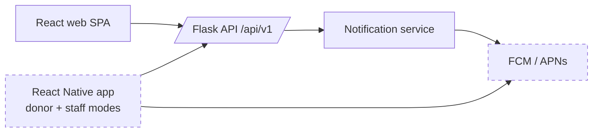
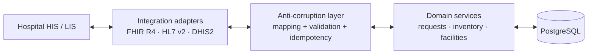

# 10 — Future Architecture: Mobile, FHIR/HL7, AI/Analytics

None of this is built in the MVP. Each section lists what is **built now** (a foundation that avoids expensive migration later) and what is **deferred**.

## W. Future mobile architecture [FUTURE]

| Concern | Built now (MVP) | Deferred |
|---|---|---|
| Auth | Token-based API; `client_type=MOBILE` returns the refresh token in the body; no cookie-only flows | Secure-storage integration, biometric unlock |
| Business logic | Entirely server-side; `allowed_actions` in responses so clients don't re-implement rules | — |
| Networking | Idempotency keys on all critical POSTs (flaky mobile networks); cursor pagination; compact responses | Offline queue for staff actions [VALIDATE: would offline work be acceptable operationally?] |
| Notifications | `PUSH` channel in the enum; channel-agnostic notification service | `device_tokens` table, push provider adapter |
| Deep links | Appeal response links use path `/r/:token`, which can become a universal/app link | App link association files |
| Types | OpenAPI → TS types shared by web and RN | Shared `@hemanet/api-client` package |
| Location | Donor location rounded server-side regardless of client | Background location is **not planned** (privacy); geofencing deferred and questionable |
| QR donor ID | `donor_reference` exists | QR rendering in app; staff scanning |
| API versioning | `/api/v1` + OpenAPI diff in CI | v2 only when a breaking change is unavoidable |

## X. Future FHIR / HL7 integration strategy [FUTURE]

**Principle:** HemaNet's domain model is independent of any external standard. Integration happens through adapters at the edge.

Candidate mappings (indicative; to be validated against the Kenyan national profiles published under the Digital Health Act framework [VALIDATE AS-46]):
| HemaNet | FHIR R4 resource |
|---|---|
| Facility | `Organization` + `Location` |
| Staff member | `Practitioner` / `PractitionerRole` |
| Blood request | `ServiceRequest` (clinical order) or `SupplyRequest` (logistics); the choice depends on the partner system |
| Blood unit | `BiologicallyDerivedProduct` |
| Issue/receipt | `SupplyDelivery` |
| Donor (if ever exchanged) | `Patient`/`Person`, **only with an explicit legal basis** |

Other Kenya-relevant integrations to evaluate [VALIDATE AS-46]:
- **KMHFL** (Kenya Master Health Facility List) lookup for facility verification (V1, the cheapest win).
- **KHIS/DHIS2** aggregate reporting export (monthly indicators) (V2–V3).
- National health information exchange / client registry, subject to Digital Health Agency requirements (V3).
- **ISBT 128** labelling if Kenyan blood services use it (AS-31). The unit-identifier design (`issuing_system` + `unit_identifier`) already allows parsing it later.

Built now: clean domain models, reference codes, `integrations/` placeholder, OpenAPI docs, idempotency, UUIDs.
Deferred: every adapter, terminology mapping and message queue.

## Y. Future AI / analytics architecture [FUTURE]

**Principle:** measure → baseline → simple heuristics → evaluated ML. AI recommendations are always explainable and human-approved, and never make clinical decisions [CONFIRMED].

| Stage | When | What |
|---|---|---|
| 0. Data foundation | **MVP (built now)** | Timestamped events (`unit_events`, `request_status_history`, appeals/responses), controlled reason codes (clean labels), consistent facility/component/group dimensions, reporting module |
| 1. Descriptive | MVP/V1 | Reports: wastage, fulfilment times, shortages, donor conversion |
| 2. Heuristic intelligence | V1 | **Days of cover** = available units ÷ trailing average daily issues (per facility × component × group); expiry-risk list (units unlikely to be used before expiry, given issue rates); transfer *suggestions* (V1+ with transfers). All transparent formulas |
| 3. Forecasting | V3, after ≥ 12 months of reliable pilot data | Demand forecasting per facility × component × group (seasonal baselines first, e.g. seasonal naive/ETS; ML only if it beats the baseline on back-tests); donor response-propensity models (fairness-audited) |
| 4. Anomaly detection | V3 | Unusual discard rates, stock drift in stock-takes, suspicious access patterns |

Architecture when needed: a read replica or nightly export to an analytics schema (`analytics.*` star schema: fact_issues, fact_requests, fact_units_daily, fact_appeals), batch jobs in the worker or a separate analytics service, and model outputs written back as **recommendations** with an explanation and model version. Evaluation reports (MAPE vs baseline, calibration) are required before any model is surfaced to users.

**Explicitly avoided:** LLM-generated clinical guidance, automated donor exclusion by opaque models, and "AI" features without an evaluation objective.
