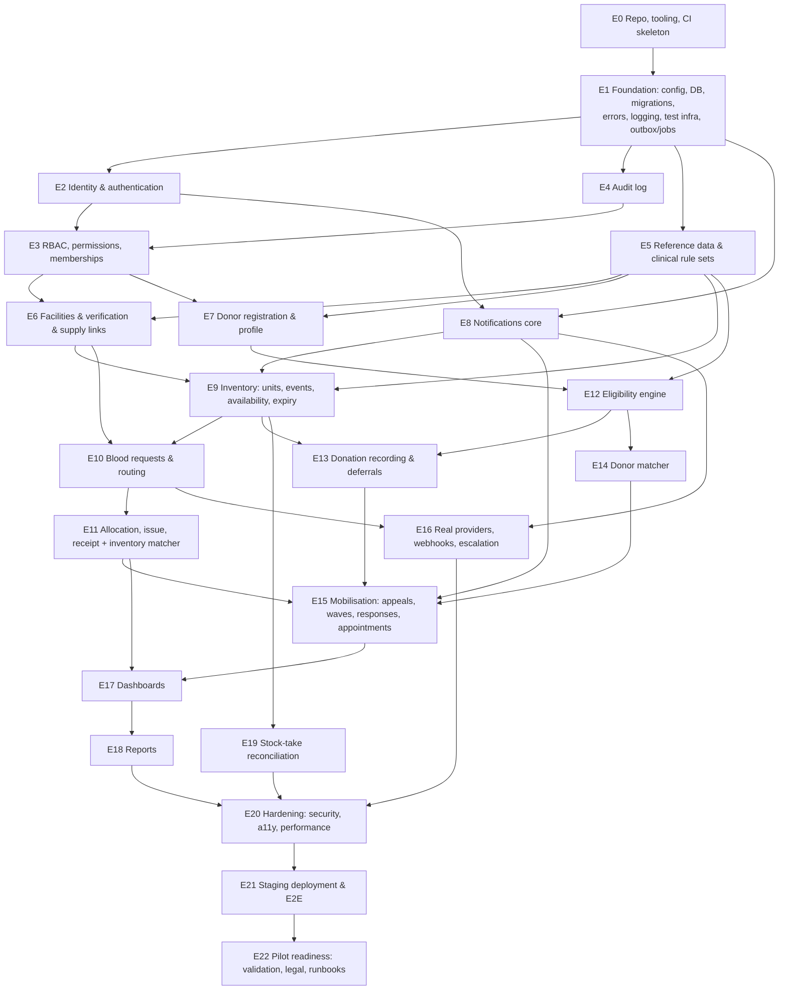

# 13 — Dependencies, Backlog, Development Order, Definition of Done

## AC. Feature dependency graph

The frontend for each epic is built together with its backend (vertical slices) from E6 onward. E0–E5 include the frontend shell: app skeleton, auth pages, layouts and the design-system basics.

## AD. Prioritised MVP backlog

Priority: **P0** = required for the MVP to be meaningful; **P1** = required before the pilot; **P2** = nice to have within Phase 1.
Size: S (≤ 1 day), M (2–3 days), L (4–5 days). Estimates are for one experienced developer, including tests; for planning only.

| # | Epic / item | Pri | Size | Depends on | Label |
|---|---|---|---|---|---|
| **E0** | **Repository & tooling** | | | | |
| 0.1 | Monorepo layout (`backend/`, `frontend/`, `docs/`, `infra/`), README, CONTRIBUTING, `.editorconfig`, `.gitignore` | P0 | S | — | PROPOSED |
| 0.2 | Docker compose (postgres, api, worker, frontend, mailpit); `.env.example` | P0 | S | 0.1 | PROPOSED |
| 0.3 | CI: lint, type-check, test jobs (placeholders), secret scan | P0 | S | 0.1 | PROPOSED |
| 0.4 | ADR folder seeded from §AB | P0 | S | approval | CONFIRMED (master §56) |
| **E1** | **Backend & frontend foundation** | | | | |
| 1.1 | App factory, typed config per env, extensions | P0 | S | E0 | PROPOSED |
| 1.2 | SQLAlchemy/Alembic setup, naming conventions, base model mixins (timestamps, version) | P0 | S | 1.1 | CONFIRMED (migrations) |
| 1.3 | Error envelope, exception mapping, request ID, structured logging + redaction | P0 | M | 1.1 | PROPOSED |
| 1.4 | Pagination, idempotency-key middleware, `If-Match` helper | P0 | M | 1.2 | PROPOSED |
| 1.5 | Outbox + jobs tables, worker loop, scheduler, heartbeat | P0 | M | 1.2 | PROPOSED |
| 1.6 | Test infrastructure: Postgres fixtures, factories, clock injection, API client helpers | P0 | M | 1.2 | CONFIRMED (testing) |
| 1.7 | Health endpoints, security headers, CORS config | P0 | S | 1.1 | PROPOSED |
| 1.8 | Frontend skeleton: Vite/TS strict, router, QueryClient, i18n, Tailwind tokens, layouts, error boundary, API client from OpenAPI | P0 | M | 0.1 | CONFIRMED stack |
| 1.9 | Design-system basics: Button, Field, Select, Dialog, Table, StatusBadge, UrgencyBadge, EmptyState, ErrorState, Banner | P0 | M | 1.8 | PROPOSED |
| **E2** | **Identity & authentication** | | | | |
| 2.1 | Users model, Argon2id, registration primitives | P0 | M | E1 | CONFIRMED |
| 2.2 | Login, access/refresh tokens, rotation, reuse detection, logout, CSRF on refresh | P0 | L | 2.1 | PROPOSED |
| 2.3 | Phone OTP + email verification, OTP abuse limits | P0 | M | 2.1, 1.5 | PROPOSED |
| 2.4 | Password reset (enumeration-safe) | P0 | S | 2.3 | PROPOSED |
| 2.5 | Brute-force protection, login attempts | P0 | S | 2.2 | PROPOSED |
| 2.6 | TOTP MFA + recovery codes + step-up | P1 | M | 2.2 | PROPOSED |
| 2.7 | Session list/revoke | P1 | S | 2.2 | PROPOSED |
| 2.8 | Frontend: login, register shells, token manager, refresh, guards | P0 | M | 2.2, 1.8 | CONFIRMED |
| **E3** | **RBAC** | | | | |
| 3.1 | Roles, permissions, seeds; `require_permission`; Scope; policy registry; 404-on-out-of-scope | P0 | L | E2 | CONFIRMED principle |
| 3.2 | Facility memberships, invitations, acceptance | P0 | M | 3.1, E6.1 | PROPOSED |
| 3.3 | Authz matrix test harness (YAML from §M) + "every route declared" CI check | P0 | M | 3.1 | PROPOSED |
| **E4** | **Audit** | | | | |
| 4.1 | `audit_events`, writer, hash chain, DB grants + trigger | P0 | M | E1 | CONFIRMED |
| 4.2 | Audit viewer API + chain verification job | P1 | M | 4.1 | PROPOSED |
| **E5** | **Reference data & clinical configuration** | | | | |
| 5.1 | Counties/sub-counties, components, reason codes seeds (with source citations) | P0 | S | E1 | PROPOSED |
| 5.2 | Rule sets + entries models; lifecycle service; one-ACTIVE constraint; freeze trigger | P0 | L | 4.1, 3.1 | PROPOSED |
| 5.3 | Development-mock rule sets (flagged) + environment guard + banner endpoint | P0 | S | 5.2 | PROPOSED |
| 5.4 | Admin UI: rule-set list/detail/edit draft/submit/record validation/activate/diff | P1 | L | 5.2, 2.6 | PROPOSED |
| **E6** | **Facilities** | | | | |
| 6.1 | Facility model, self-registration (API + UI) | P0 | M | E3.1 | CONFIRMED |
| 6.2 | Admin verification queue + decision (API + UI) | P0 | M | 6.1 | CONFIRMED |
| 6.3 | Supply links (admin) | P0 | S | 6.2 | PROPOSED |
| 6.4 | Storage locations; facility settings UI; staff management UI | P1 | M | 3.2 | PROPOSED |
| **E7** | **Donors** | | | | |
| 7.1 | Donor registration flow (API + multi-step UI), consent capture, rounding of location | P0 | L | E2, 5.1 | CONFIRMED |
| 7.2 | Profile, availability, notification preferences (API + UI) | P0 | M | 7.1 | CONFIRMED/PROPOSED |
| 7.3 | Data export/deactivation | P2 | M | 7.1 | PROPOSED [VALIDATE] |
| **E8** | **Notifications core** | | | | |
| 8.1 | Notification + delivery models; service; policy (prefs, consent, quiet hours, caps, verified contact) | P0 | L | 1.5, E2 | CONFIRMED |
| 8.2 | Template system with variable allow-lists (PHI guard) | P0 | M | 8.1 | PROPOSED |
| 8.3 | In-app inbox API + UI; unread count polling | P0 | M | 8.1 | CONFIRMED |
| 8.4 | Dev mock providers (console SMS, Mailpit) with MOCK labelling | P0 | S | 8.1 | CONFIRMED |
| **E9** | **Inventory** | | | | |
| 9.1 | Units model, unit state machine (pure), unit events | P0 | L | E6, 5.2 | CONFIRMED |
| 9.2 | Register unit (single), scan-mode UI | P0 | M | 9.1 | CONFIRMED |
| 9.3 | Bulk register + CSV dry-run import | P1 | M | 9.2 | PROPOSED |
| 9.4 | Release/quarantine/discard/correct actions (API + UI) | P0 | M | 9.1 | CONFIRMED/PROPOSED |
| 9.5 | Availability view, facility inventory matrix UI, unit detail + history UI | P0 | M | 9.1 | CONFIRMED |
| 9.6 | Expiry job + expiring-soon view + digest | P0 | M | 9.1, 8.1 | CONFIRMED |
| 9.7 | Thresholds + low-stock detection + inventory alert | P0 | M | 9.5 | CONFIRMED |
| 9.8 | Network availability (hospital view) | P0 | S | 9.5, 6.3 | CONFIRMED |
| **E10** | **Blood requests** | | | | |
| 10.1 | Request model, state machine (pure), status recompute, history | P0 | L | E9, 5.2 | CONFIRMED |
| 10.2 | Create + route (API + form UI with availability panel) | P0 | M | 10.1, 9.8 | CONFIRMED |
| 10.3 | Supplier accept/decline; re-route; cancel; expire job | P0 | M | 10.1 | CONFIRMED |
| 10.4 | Hospital request list/detail/timeline UI; supplier incoming queue UI | P0 | M | 10.2 | CONFIRMED |
| **E11** | **Allocation & fulfilment** | | | | |
| 11.1 | Inventory matcher (pure) + suggestions endpoint with explanations/shortfall | P0 | M | 10.1 | PROPOSED |
| 11.2 | Reserve (row locks + partial unique index), release, reservation timeout job | P0 | L | 11.1 | PROPOSED |
| 11.3 | Issue + receipt + close (API + UI) | P0 | M | 11.2 | PROPOSED [VALIDATE AS-05] |
| 11.4 | Concurrency test suite | P0 | M | 11.2 | CONFIRMED (master §33) |
| **E12** | **Eligibility** | | | | |
| 12.1 | Rule-type implementations + parameter schemas + evaluator (fail closed) | P0 | L | 5.2 | CONFIRMED principle |
| 12.2 | Donor eligibility endpoint + dashboard card (3-state, reasons, next date) | P0 | M | 12.1, 7.1 | CONFIRMED |
| **E13** | **Donations** | | | | |
| 13.1 | Staff donor lookup (audited), blood-group confirmation | P0 | M | 7.1, E3 | PROPOSED |
| 13.2 | Record donation (API + UI) → register resulting units (QUARANTINED) | P0 | M | 13.1, 9.2 | CONFIRMED |
| 13.3 | Deferral category recording/lifting | P1 | S | 13.1 | PROPOSED [VALIDATE AS-13] |
| 13.4 | Donor donation history UI | P0 | S | 13.2 | CONFIRMED |
| **E14** | **Donor matcher** | | | | |
| 14.1 | Candidate generation (SQL, geo interface), hard filters, scoring, explanations (pure + golden tests) | P0 | L | 12.1 | CONFIRMED |
| **E15** | **Mobilisation** | | | | |
| 15.1 | Appeals model + lifecycle; suggested appeals from threshold/shortfall events | P0 | L | 9.7, 11.1 | CONFIRMED |
| 15.2 | Appeal editor UI + target-group suggestions + preview (masked, explained) | P0 | M | 15.1, 14.1 | CONFIRMED |
| 15.3 | Waves: launch, snapshots, signed response tokens, notifications | P0 | M | 15.2, 8.2 | CONFIRMED |
| 15.4 | Donor response (in-app + link page `/r/:token`), slots, appointments | P0 | M | 15.3 | CONFIRMED |
| 15.5 | Check-in / no-show; donation linkage; reveal-on-accept for staff | P0 | M | 15.4, 13.2 | CONFIRMED |
| 15.6 | Hospital appeal summary (counts only) | P1 | S | 15.1 | PROPOSED |
| **E16** | **Real providers & escalation** | | | | |
| 16.1 | Email provider adapter (SendGrid or SES) | P1 | S | 8.1 | CONFIRMED |
| 16.2 | SMS provider adapter (Africa's Talking and/or Twilio) + cost tracking | P1 | M | 8.1 | CONFIRMED |
| 16.3 | Delivery webhooks with signature verification | P1 | M | 16.1, 16.2 | PROPOSED |
| 16.4 | Request escalation jobs; wave check prompts | P1 | M | 10.3, 15.3 | PROPOSED |
| 16.5 | Admin delivery health view + manual retry | P1 | S | 16.3 | PROPOSED |
| **E17** | **Dashboards** | | | | |
| 17.1 | Donor, hospital, blood-bank, admin dashboards (polling) | P0 | L | E11, E15 | CONFIRMED |
| **E18** | **Reports** | | | | |
| 18.1 | Donation trends, shortages, donor activity | P0 | M | 17.1 | CONFIRMED |
| 18.2 | Request performance, wastage; CSV export (audited) | P1 | M | 18.1 | PROPOSED |
| **E19** | **Reconciliation** | | | | |
| 19.1 | Stock-takes | P1 | M | E9 | PROPOSED |
| **E20** | **Hardening** | | | | |
| 20.1 | Security review against ASVS L2 checklist; ZAP baseline; fix findings | P0 | L | all P0 | PROPOSED |
| 20.2 | Accessibility audit (axe + manual keyboard + screen reader pass) | P0 | M | all UI | PROPOSED |
| 20.3 | Performance test at pilot volumes; index tuning | P1 | M | all | PROPOSED |
| 20.4 | Kiswahili translation of donor-facing strings | P1 | M | 1.8 | PROPOSED [VALIDATE AS-23] |
| **E21** | **Staging** | | | | |
| 21.1 | Infrastructure as code for staging; CI/CD deploy; backups; monitoring & alerts | P1 | L | 20.1 | PROPOSED |
| 21.2 | Full E2E suite in CI against staging-like stack | P0 | M | E17 | CONFIRMED |
| **E22** | **Pilot readiness (non-code + code)** | | | | |
| 22.1 | Stakeholder validation of AA items; record results; configure validated rule sets | P0-pilot | — | stakeholders | CONFIRMED (your decision 2) |
| 22.2 | Legal: DPIA, ODPC registration, privacy notice, terms, residency decision, Digital Health Act check | P0-pilot | — | counsel | VALIDATE |
| 22.3 | Runbooks, downtime snapshot export, restore drill, on-call | P0-pilot | M | 21.1 | PROPOSED |
| 22.4 | Production hosting per residency decision | P0-pilot | L | 22.2 | PROPOSED |
| 22.5 | Baseline measurement plan at pilot sites | P0-pilot | — | 22.1 | CONFIRMED (PDF pilot plan) |

## AE. Exact development order

Each step ends with a **gate**: its tests pass in CI, docs are updated, and you review before the next step starts.

| Step | Work | Gate / demo |
|---|---|---|
| 1 | E0: repo, compose, CI skeleton, ADRs | `docker compose up` runs empty api/frontend; CI green |
| 2 | E1.1–1.7: backend foundation | `/healthz`, `/readyz`; error envelope tests; worker processes a no-op job |
| 3 | E1.8–1.9: frontend shell & design system | Storybook-free component tests + axe pass; layouts render |
| 4 | E4.1: audit | Append-only proven by tests (UPDATE/DELETE fail) |
| 5 | E2.1–2.5, 2.8: authentication | Register/login/refresh/logout E2E; brute-force tests |
| 6 | E3.1, 3.3: RBAC + authz harness | Harness runs (initially few routes); "undeclared route" check enforced |
| 7 | E5.1–5.3: reference data, rule sets, mock guard | Pilot-mode config refuses mock activation (test) |
| 8 | E6.1–6.3 + E3.2: facilities, verification, memberships | J5 E2E (facility onboarding) |
| 9 | E7.1–7.2: donor onboarding | J1 E2E minus eligibility |
| 10 | E8.1–8.4: notifications core | Events → in-app + mock email/SMS; PHI guard tests |
| 11 | E9.1–9.2, 9.4–9.8: inventory | Register/release/discard; availability; expiry job; low-stock alert |
| 12 | E10: requests | Create/route/accept/decline/cancel/expire |
| 13 | E11: allocation & fulfilment + concurrency suite | **J2+J3 E2E: first complete fulfilment slice** ← key milestone |
| 14 | E12: eligibility engine | Golden tests per rule type; donor dashboard card |
| 15 | E13.1–13.2, 13.4: donation recording | Donation → quarantined unit → release |
| 16 | E14: donor matcher | Golden explanation tests; performance at 50k synthetic donors |
| 17 | E15.1–15.5: mobilisation | **J4 E2E: full mobilisation loop** ← key milestone |
| 18 | E17, E18.1: dashboards & core reports | Role dashboards reviewed against master §30 questions |
| 19 | E2.6–2.7, E4.2, E5.4, E6.4: admin hardening features | MFA/step-up enforced on sensitive actions |
| 20 | E16: real providers (sandbox), webhooks, escalation | Delivery tracking with sandbox providers |
| 21 | E9.3, E13.3, E15.6, E18.2, E19: P1 completions | — |
| 22 | E20: security, accessibility, performance hardening | ASVS checklist signed off; zero serious axe issues; k6 targets met |
| 23 | E21: staging, IaC, monitoring, backups | Restore drill passes |
| 24 | E22: pilot readiness (runs **in parallel from step 1** for the non-code work: stakeholder outreach and legal questions) | Pilot go/no-go review |

**Rough effort:** ~26–32 developer-weeks for steps 1–23 (one experienced developer). This is an estimate for planning, not a commitment.

## AF. Definition of Done

A backlog item is **Done** only when every applicable box is ticked:

**Functionality**
- [ ] Backend use case, API and frontend implemented as specified; `allowed_actions` correct
- [ ] Works end-to-end in the local docker stack

**Data integrity**
- [ ] DB constraints enforce invariants (not only application code)
- [ ] State transitions go through the state machine only; invalid transitions tested
- [ ] Transactions wrap multi-row changes; concurrency considered and tested where relevant
- [ ] Migration included, tested upgrade-from-empty and on a seeded DB; backward-compatible

**Security & privacy**
- [ ] Permission declared on every new route; authz matrix entries added and passing
- [ ] Out-of-scope access returns 404; no sensitive fields in responses (schema reviewed)
- [ ] Input validation with `unknown=RAISE`; free text length-limited
- [ ] No PHI/secrets in logs or notifications (redaction tests where relevant)
- [ ] Data minimisation question answered: "Do we need to store this?"

**Clinical safety**
- [ ] No clinical value hardcoded; reads the ACTIVE rule set only through `clinical_config`
- [ ] Behaviour with a missing/unvalidated rule set defined and tested (fail closed)
- [ ] Any new clinical/operational assumption added to §AA

**Auditability**
- [ ] Audit events written for significant actions (Q.3); unit events for unit changes

**Error handling & resilience**
- [ ] Error envelope with codes; frontend shows meaningful error and empty states
- [ ] Idempotency on critical POSTs; retries safe
- [ ] Failure of external providers handled (tests with fakes)

**UX & accessibility**
- [ ] Answers the role's key questions (master §30) and is readable by the intended user in seconds
- [ ] Keyboard-operable, labelled, focus managed, status not conveyed by colour alone; axe clean
- [ ] Works at 360 px width (donor) / tablet (staff); strings externalised

**Testing**
- [ ] Unit tests for domain logic; service/API tests; dangerous cases from §S.3 that apply
- [ ] CI green (lint, types, tests, security scans, OpenAPI breaking-change check)

**Documentation**
- [ ] OpenAPI descriptions complete; README/architecture/DB docs updated; ADR added if a decision was made
- [ ] Environment variables added to `.env.example`

**Future compatibility**
- [ ] No web-only assumptions in the API (usable by the future mobile client)
- [ ] No business logic only in React

---

## Decisions needed from you

> **Resolved 2026-09-30:** all 11 decisions below were accepted as written (see [docs/adr/](../adr/README.md)).

The **[PROPOSED]** items with the most impact on implementation. Please approve, amend or reject each:

1. **ADR-002:** domain-first backend layout (differs from the suggested structure).
2. **ADR-003:** Postgres-backed jobs/outbox instead of Celery/Redis.
3. **ADR-005:** rule-set lifecycle with a separate CLINICAL_CONFIG_APPROVER role and MFA step-up.
4. **ADR-007:** JWT access + rotating refresh tokens (vs. server sessions).
5. **ADR-013:** no patient identifiers at all in the MVP, and dropping S3 prescription uploads.
6. **ADR-011:** reject blockchain in favour of a hash-chained audit log.
7. **ADR-018 / AS-20:** appeals are suggested by the system and launched by staff (no automatic donor SMS on low stock).
8. **Donor privacy:** donors masked to staff until they accept; hospitals see only banded counts.
9. **Admin "verify donors" (PDF):** replaced by phone OTP + lab confirmation of blood group by blood-bank staff, rather than manual admin review of every donor.
10. **Scope:** stock-take reconciliation (E19) and Kiswahili (20.4) as P1 before the pilot.
11. **Hosting:** defer the AWS-vs-in-Kenya decision until legal input on data residency (AS-40); build portable.
